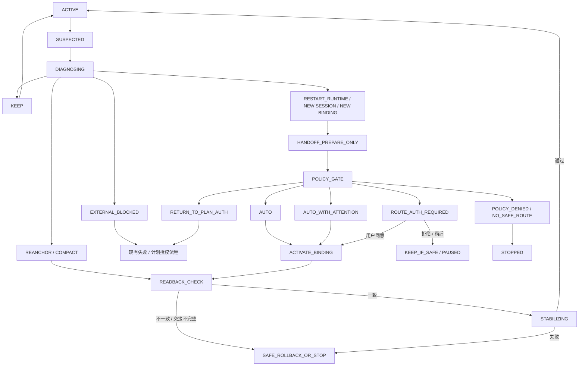

# Syn 会话—模型自适应路由治理层设计 v1

> 资料状态（2026-08-09）：候选详情来源，不再在本文件维护活跃候选状态。已确认的“角色身份与模型分离、支持多种智能体与服务提供方”进入 `docs/product/syn-product-canon-v1.md`；仍未确认的自动切换、提醒阈值和治理细节统一看 `docs/product/candidate-register-v1.md`。本文不提供实现授权。

日期：2026-07-10

状态：**候选设计，未拍板，不是任务授权，不代表功能已实现。**

范围：定义 Syn 如何识别“是否需要换对话 / 换模型”，以及不同职位由谁决定、如何提醒、如何交接、如何审计。
当前实现事实：截至本文日期，真实可执行主路径仍以 `codex-local` 为主；其他 provider / model 多数只有描述、只读状态或待验证能力。因此本文可以先钉策略和协议，不能写成“已经能跨模型自动路由”。

上承权威：

- `AUTHORITY.md`
- `CURRENT.md`
- `decisions/2026-07-09-session-mode-drives-per-task-creation-v1.md`
- `decisions/2026-07-08-phase-b2-execution-loop-final-v1.md`
- `decisions/2026-07-08-b2-transfer-protocol-gap-final-v1.md`
- `decisions/2026-07-07-phase-b-advisory-supervisor-and-secretary-v1.md`
- `decisions/2026-07-02-project-jiaoban-tab-final-design-v1.md`
- `docs/workflow-task-package-design-v1.md`
- `docs/workbench-system-architecture-v1.md`
- `docs/middleware-version-development-plan-v1.md`
- `docs/own-agent-and-company-vision-v1.md`
- `principles.md`
- 最终产品蓝图 `local-ai-workbench-blueprint-v1.md`

---

## 0. 结论先行

> **先证明是上下文问题还是模型问题，再决定换不换；受限执行角色可在授权池内自动处理，关键判断角色不静默换脑；模型可以更换，职位身份、项目事实、验收标准和权限不能跟着漂移。**

这一层不是“模型下拉框自动化”，而是控制核心里的一个受治理路由能力。它必须先回答五个问题：

1. 失败来自上下文污染、模型能力、工具 / 环境、规格缺口，还是权限 / 供应商问题？
2. 最小足够动作是重新锚定、压缩、同模型新会话，还是新模型新会话？
3. 被处理的是受限执行角色，还是会影响方案、事实、终标和用户判断的关键角色？
4. 这次动作是否仍在已批准的模型池、预算、隐私、数据外发和任务包范围内？
5. 换完以后如何证明没有丢目标、丢权限、丢事实或把失败包装成成功？

首版建议把用户所说的“关键角色提醒我”解释为：

- 普通底层进程恢复：可以自动，不算逻辑换对话；
- 关键角色放弃原逻辑上下文：先提醒，默认等待用户确认；
- 关键角色更换模型 / 供应商：必须等待用户确认；
- 后续如需给某个关键职位建立长期预授权，再单独走信任阶梯，不在首版默认开放。

### 0.1 三个必须正面解决的旧设计冲突

1. **当前自动模式已经是每个 worker 任务新建独立会话。** 新层不再重复判断“新任务要不要新会话”，只处理任务执行中的二次换会话、失败恢复、上下文污染和模型调整；关键角色持久的是 `RoleIdentity` 与逻辑 `ConversationLineage`，不是必须常驻的 provider session，项目主管底层会话仍可按现有 canon 每次重启。
2. **最终蓝图规定一个会话固定一个模型。** 所以换模型必然新建会话；禁止出现“原会话原地换脑”。换会话可以仍用同一模型。
3. **最终蓝图本来就允许项目主管从项目模型池自动选模，但后续保守规则又写了固定 LM、缺模型即阻断和不自动选。** B2 已把 `model_id` 从硬编码改成每任务可配置，但这不等于已经具备自动选模。本设计是在落实蓝图愿景，同时拟只对“受限执行角色 + 已授权模型池”局部取代后来的保守执行规则；关键角色、模型池外模型、凭据、隐私和数据外发边界仍不自动改变。该局部取代必须经用户拍板，不能靠实现暗改。

### 0.2 本设计不承诺什么

- 不承诺“更强模型一定更正确”。
- 不用对话轮数、token 数或一次失败直接触发换模型。
- 不让模型自己决定自己是否应该被替换。
- 不自动改变目标、方案、验收标准、读写范围、工具权限、数据出口或最终完成判定。
- 不把新旗舰模型发布当成生产角色立即升级的理由。
- 不承诺云模型行为级精确重放；多数情况下只能做到结构可追溯。
- 不新增一个“路由主管 agent”。检测和执行归控制核心；秘书只聚合、解释和提醒。

---

## 1. 先分清四个对象

如果把“角色、对话、底层会话、模型”混成一个对象，提醒会泛滥，审计也会失真。

| 对象 | 含义 | 是否长期存在 |
|---|---|---|
| `RoleIdentity` | 职位档案、职责、权限、立场文件和正式记忆边界 | 是 |
| `ConversationLineage` | 围绕同一目标形成的逻辑讨论脉络，可跨底层进程恢复 | 可长期 |
| `RuntimeSession` | Codex / Claude Code 等 provider 的一次真实底层会话 | 可随时重建 |
| `ModelBinding` | 本次运行实际使用的 provider、endpoint、精确 model ID 与能力档 | 每次运行钉死 |

因此：

- 底层进程崩溃后恢复同一 `ConversationLineage`，不等于用户理解的“换对话”；
- 放弃旧上下文、从权威交接包重新开始，才是逻辑换对话；
- 更换 `ModelBinding` 必须创建新 `RuntimeSession`，并保留父子关系；
- 员工身份仍由 `RoleIdentity` 决定，模型变化不等于换员工；
- 信任记账必须记录 `RoleIdentityVersion + RoleModelPolicyVersion + exact ModelBinding`，不能只记职位名。

`ConversationLineage` 只是运行期派生的分组和追踪关系，不是项目事实源、正式记忆源、工作流状态源，也不是新的项目根。任何续接都仍以现行权威对象为准。

这对旧“固定 LM”口径的候选修订是：

> **职位身份固定，职位的模型政策固定；关键职位默认固定到一个模型档，受限执行职位可在预先批准的模型范围内弹性绑定。每次真实绑定仍然精确、可审计。**

---

## 2. 角色不按名字硬编码，按影响面分级

角色名称会随阶段变化，权限不能绑死在“五角色 / 六角色”的编号上。判定顺序应是：

```text
角色默认级别 × 当前动作风险 × 项目 / 数据范围
```

任何更高风险动作都可以把默认执行角色向上提升，不能因职位名叫 worker 就永远自动。

### 2.1 角色分级

| 等级 | 判定标准 | 拟议角色映射 | 会话 / 模型处置权 |
|---|---|---|---|
| `DETERMINISTIC` | 无 LM，只按规则读盘、校验或聚合 | 秘书确定性摘要、guard、read model、脚本 | 无模型可换；规则升级另走代码 / 配置治理 |
| `EXECUTION` | 只执行已授权 TaskPackage，不改目标、不确认事实、不终标 | worker、格式化、检索、测试执行、只产证据的审查 worker | 在 `RoutingEnvelope` 内可自动 |
| `KEY` | 会影响方案、方向、事实确认、完成判断、跨项目信息或用户注意力 | Syn 正门、项目 / 全局咨询、项目主管、全局主管、秘书 AI 解释 | 该关键角色自身的逻辑会话、模型、provider 或实质运行参数变化，默认用户确认后执行；不等于项目主管的所有日常处置都逐项问用户 |
| `CONDITIONAL` | 是否关键取决于当次职责 | 审查 / 验证角色 | 只产证据时按 `EXECUTION`；有否决、终标或改方向权时按 `KEY` |
| `UNKNOWN` | 未登记或策略版本无法识别 | 新角色、第三方 agent | 失败关闭，按 `KEY` 处理 |

### 2.2 看“被换的角色”，不只看“谁发起”

- 项目主管可以依据策略自动给 worker 换会话 / 换模型，因为目标角色是 `EXECUTION`；
- 项目主管不能因此静默更换自己的模型，因为目标角色是 `KEY`；
- worker 可以上报“上下文异常 / 能力不足”症状，但它的自述只是弱信号，决定由控制核心作出；
- 秘书可以把建议聚合上脸，但不能替用户接受建议，也不能直接执行路由动作；
- 全局主管继续是 advisory，不因本层存在获得闸权。

### 2.3 动作风险的向上覆盖

以下任一情况出现，即使目标角色平时是 `EXECUTION`，也必须升级为用户确认：

- 触及主分支、生产、真实业务数据或不可逆副作用；
- 扩大读写范围、工具权限、网络外发或凭据范围；
- 跨项目迁移上下文或数据；
- 换到项目批准模型池外；
- 供应商变化超出已批准集合，或导致隐私、数据保留、外发政策弱化；
- 成本未知、超过预算或候选模型价格不可验证；
- 修改目标、方案、验收标准、held-out、veto 或安全闸；
- 新模型破坏执行 / 审查的独立性约束。

---

## 3. `RoutingEnvelope`：自动处置的授权边界

“worker 可以自动换”不能是一句空授权。每个可自动路由的任务都必须引用一个版本化 `RoutingEnvelope`。它只能由以下权威来源确定性求交集生成，路由层无权自行扩张：

```text
用户批准的项目模型策略 / PlanAuthorization
  ∩ RoleModelPolicy
  ∩ TaskPackage 要求
  ∩ 当前 provider capability / availability snapshot
  = RoutingEnvelope
```

当前 `PlanAuthorization` 尚未显式承载项目模型池 / 模型政策引用；把 `model_policy_ref` 或等价字段纳入授权对象，是实施前必须单独拍板的 schema 变化。没有这一步，只能做建议，不能声称 worker 已获自动换模授权。

`RoutingEnvelope` 最小字段：

```text
RoutingEnvelope
  authorization_snapshot_id / authorization_snapshot_hash
  plan_authorization_ref / version
  project_model_policy_ref / version
  role_model_policy_ref / version
  task_package_ref / version
  role_scope
  project_model_pool_version
  allowed_model_profile_ids[]
  allowed_provider_ids[]
  allowed_data_egress_classes[]
  session_actions[]
  max_auto_switches
  max_diagnostic_probes
  cost_budget
  latency_budget
  capability_floor
  verification_floor
  review_independence_rules[]
  cooldown_policy
  rollback_policy
  provider_snapshot_id / observed_at
  expires_at
```

`RoutingEnvelope`、项目模型池、成本边界和数据政策必须绑定到用户批准的授权快照，并把版本 / hash 写入 TaskPackage。运行时 provider snapshot 只可让候选变少，不能把批准后新出现的模型或 endpoint 静默加入可选集合；边界或版本变化必须重新授权。

自动动作成立的必要条件必须同时满足：

1. 仍是同一任务目标、方案版本和验收标准；
2. 新模型在已批准项目模型池中；
3. 权限、工具和数据外发边界不扩大；
4. 隐私等级不降低；
5. 成本、探针、重试和切换次数未越界；
6. 新模型能力满足任务要求；
7. 旧会话、原因和证据被保留；
8. 新会话完成结构化 readback；
9. 换后重新验证，不直接宣布成功。
10. 当前任务不处于 `waiting_decision`，没有 worker help / 疑似 help、未解决方向风险或权限风险。

第 1、3、4、9、10 项或安全底线不满足，不得用一次“同意路由”覆盖；应返回原计划授权链，或在没有安全路径时硬阻断。只有“候选路由本身仍安全、但按职位政策需要人确认”才进入路由确认门。三类结果在 §6 分开定义。

模型池只声明“项目允许用什么”，provider snapshot 只声明“技术上现在能用什么”。二者取交集，不得把 availability 当 authorization。

---

## 4. 两条判断轴分开，执行时再联动

### 4.1 会话卫生动作

| 动作 | 含义 | 是否保留模型 |
|---|---|---|
| `KEEP` | 当前上下文健康，继续 | 是 |
| `REANCHOR` | 在当前会话重新注入任务锚点并做 readback | 是 |
| `COMPACT` | 使用 provider 支持的受控压缩，并校验压缩检查点 | 是 |
| `RESTART_RUNTIME` | 底层会话故障，按同一逻辑脉络重建 | 是 |
| `NEW_SESSION_SAME_MODEL` | 放弃旧上下文，从权威交接包开干净会话 | 是 |
| `ISOLATED_REVIEW_SESSION` | 为独立复核另开最小上下文会话 | 通常是 |
| `STOP_AND_ASK` | 无安全动作，停下请用户 / 主管处理 | 不适用 |

### 4.2 模型路由动作

| 动作 | 含义 |
|---|---|
| `KEEP_MODEL` | 当前模型满足能力、成本、隐私与可用性要求 |
| `ADJUST_RUNTIME_PROFILE` | 在同一模型允许范围内调整推理强度等运行参数；仍需遵守职位策略 |
| `CHANGE_CAPABILITY_PROFILE` | 更换到另一个能力档，必须新建会话 |
| `FALLBACK_PROVIDER` | provider 不可用时换到兼容供应商，必须新建会话并重算数据边界 |
| `STOP_NO_SAFE_MODEL` | 没有满足能力 / 隐私 / 预算的安全候选，停止 |

`ADJUST_RUNTIME_PROFILE` 虽不一定更换 model ID，也可能改变推理行为、工具模式、成本和延迟。凡会实质影响输出行为的参数都属于不可变 `ModelBinding` 的一部分：变更时创建新 binding 版本和新 `RuntimeSession`；对 `KEY` 角色按换模型同级确认，对 `EXECUTION` 也只能在已批准 Envelope 内自动调整。普通网络重试或进程超时不属于“换脑参数”。

逻辑上两条轴分开，因为“上下文坏了”和“模型不够”不是一回事；执行上遵守：

```text
ADJUST_RUNTIME_PROFILE、CHANGE_CAPABILITY_PROFILE 或 FALLBACK_PROVIDER
  => 必须 NEW RuntimeSession
  => 必须新 ModelBinding
  => worker 必须新 TaskPackage 版本；关键角色必须新 ModelBinding 版本
  => 禁止原会话原地换脑
```

### 4.3 模型策略不写死具体商品名

策略引用稳定能力档和任务要求，不引用“当前旗舰模型”名称，也不把 endpoint / 账户政策误写成模型固有能力：

```text
ModelRequirements
  reasoning_class
  context_class
  modalities[]
  tool_protocols[]
  structured_output_support
  capability_floor
  verification_floor
  max_cost_class / max_latency_class
  data_egress_and_retention_requirements

ModelEndpointDescriptor
  provider_id / endpoint_id
  exact_model_id / exposed_revision
  advertised_and_probed_capabilities[]
  account_data_policy
  cost_and_latency_snapshot
  availability_and_health
  tool_protocols[]
  observed_at
```

运行时 `ModelRegistry` 依据 `ModelRequirements + RoleModelPolicy + RoutingEnvelope`，从实际 provider adapter 的 capability / availability snapshot 中解析具体 endpoint，并把精确结果写进 `ModelBinding` 和审计。同一别名在运行中不得重新解析：关键角色保持原精确绑定，直到用户接受新 binding；执行角色也只有在兼容性探针通过且 Envelope 允许时才可采用。provider 不暴露修订号时，必须标记绑定不完全、降低回放等级，不能假装没有漂移。

provider fallback 的统一规则是：`EXECUTION` 仅可在计划已批准的 provider 集合内、数据政策不弱化、成本不越界且处于自动模式时自动 fallback；`KEY` 始终确认；集合外变化返回原计划授权流程。没有安全 endpoint 时进入硬阻断，不把“继续”按钮当成政策豁免。

---

## 5. 根因先分类，禁止“失败 = 换更强模型”

### 5.1 根因—动作矩阵

| `reason_code` | 典型证据 | 首选动作 | 明确不能做 |
|---|---|---|---|
| `NEW_TASK_BASELINE` | 新的独立 TaskPackage | 沿用 B2：自动新建 worker 会话 | 不当成自适应异常 |
| `CONTEXT_BUDGET_PRESSURE` | provider 明确截断 / 压缩信号；关键锚点 readback 丢失 | `COMPACT`；失败后 `NEW_SESSION_SAME_MODEL` | 不直接升级模型 |
| `CONTEXT_CONTAMINATION` | 反复引用已废弃事实；干净同模型会话明显恢复 | `NEW_SESSION_SAME_MODEL` | 不把污染迁进自由摘要 |
| `CAPABILITY_MISMATCH` | 缺少任务确定要求的能力；同模型干净会话仍失败、候选模型经同一验收通过 | `CHANGE_CAPABILITY_PROFILE` + 新会话 | 不凭榜单或模型自述升级 |
| `COST_OR_LATENCY_PRESSURE` | 稳定超预算，且有满足质量底线的低成本候选 | 降到最低充分能力档 | 不牺牲 capability / verification floor |
| `PROVIDER_UNAVAILABLE` | 明确 availability / auth / endpoint 故障 | 兼容 fallback；无安全候选则停 | 不把 401 / 额度 / 网络错说成模型能力不足 |
| `SPEC_OR_AUTH_GAP` | 目标、验收、权限或方向不明确 | `STOP_AND_ASK` | 不换模型掩盖缺规格 |
| `TOOL_OR_ENV_FAILURE` | 编译器、依赖、路径、沙箱、工具或权限错误 | 进入现有失败恢复 | 不升级模型 |
| `VERIFIER_GAP` | 验收太弱、冲突、可被修改或 held-out 泄露 | 停下修规格 / oracle，重新授权 | 不让执行者改考卷 |
| `ACTUAL_DEFECT` | 规格稳定、环境健康、外部验证仍失败 | 同模型有限重试；证据充分后才考虑换档 | 不把真实 bug 包装成上下文问题 |
| `UNKNOWN` | 证据不足或信号冲突 | 保持或停下升级处理 | 不自动轮询多个模型 |

### 5.2 诊断顺序

```text
发现异常
  -> 先排环境 / 工具 / 权限 / 供应商故障
  -> 校验 TaskPackage、方案版本、验收与记忆来源是否仍有效
  -> 在当前会话做一次最小 REANCHOR
  -> 在安全且预算允许时，用同模型、同任务包、干净会话探针
       -> 成功：优先按上下文问题处置并保留模型；置信度随重复或确定性证据上升
       -> 仍失败：再评估候选模型的同输入 / 同验收影子探针
            -> 候选通过：能力或兼容问题更可能；仍记录随机性和环境差异
            -> 两边失败：规格、环境、资料或真实缺陷，不继续换模
```

编码任务的探针必须在隔离工作树 / 不可变检查点上运行，不能让两个候选并发写同一工作区。若做不到安全、同输入、同验收，则降低置信度，不假装已经证明因果。

### 5.3 信号强弱

可单独触发“进入诊断”的强信号：

- provider 明确报告上下文溢出、截断或必要内容丢失；
- 当前模型确定性地缺少任务要求的能力；
- 模型 / endpoint 不可用、被移除或接口契约改变；
- 当前模型与项目隐私、外发或工具策略冲突；
- 同模型干净会话与原会话结果显著分叉；
- TaskPackage、方案或授权版本已改变。

至少需要两个独立来源相互印证的软信号：

- 纠正后仍反复引用已废弃事实；
- 多次丢失任务包里的硬约束；
- 连续结构化输出失败；
- 同一种归一化错误在一次纠偏后重复；
- 压缩后关键 ID、权限或停止条件 readback 失败；
- 单任务成本或耗时趋势异常。

不得单独触发切换：

- token 数高；
- 一次回答不好、一次幻觉或一次慢响应；
- 模型自称“我需要更强模型”；
- 用户只觉得语气变了；
- 新旗舰模型发布；
- 公共榜单分数变化。

---

## 6. 决策状态机



状态机不得出现 `SWITCH_MODEL_IN_PLACE`。

五类政策门：

- `AUTO`：受限执行角色，动作在 `RoutingEnvelope` 内；自动执行，留审计，不打断用户；
- `AUTO_WITH_ATTENTION`：只用于本可自动完成但值得告知的边界内恢复，例如关键角色在同一逻辑谱系、同一精确 binding 下重启底层进程，或 worker 自动换会话；它不是授权替代品；
- `ROUTE_AUTH_REQUIRED`：候选路径本身安全且不改变原计划，只因目标角色为 `KEY` 或模式为 manual 而等待用户；
- `RETURN_TO_PLAN_AUTH`：候选会改变模型池、权限、隐私 / 外发、预算、目标、验收、held-out、veto 或安全闸，必须回原计划 / 规格授权链，不能在路由提醒卡里顺手批准；
- `POLICY_DENIED / NO_SAFE_ROUTE`：没有满足能力、隐私或安全底线的合法路径，保持暂停或结束；用户拒绝也不能让它直接回 `ACTIVE`。

`HANDOFF_PREPARE_ONLY` 只允许从本地权威对象组装候选包，不激活新会话 / binding，也不额外调用模型或外发上下文。任何带费用或数据外发的探针必须已有授权。关键角色的逻辑新会话、模型、provider 或实质运行参数变化只有在 `ROUTE_AUTH_REQUIRED` 获同意后才能进入 `ACTIVATE_BINDING`。

`REANCHOR` 和 `COMPACT` 也会改变模型实际看到的上下文，不能与 `KEEP` 一样直接回运行态；必须经过结构化 readback。readback 不一致、交接包不完整或换后验收失败，只能恢复到最近的**安全且可恢复**检查点 / binding；若原会话已污染、provider 已不可用或不存在安全目标，就停止，禁止把触发故障的旧会话自动重新激活。

---

## 7. 最小数据对象

不新增独立“路由 agent”。以下是逻辑契约，不要求首版全部新建数据库实体：第一版持久化增量优先只有 `RoutingChange` 与 `ContextHandoffPacket`，其余引用现有角色政策、授权、TaskPackage 和 provider registry。

### 7.1 `RoleModelPolicy`

职位的稳定模型治理配置；TaskPackage 的 Envelope 只能收窄，不能扩大：

```text
RoleModelPolicy
  role_id / role_version
  governance_class
  binding_mode: fixed | confirm_each_change | elastic
  default_model_profile_id
  allowed_model_profile_ids[]
  allowed_provider_ids[]
  allowed_data_egress_classes[]
  cost_class_limit
  session_change_policy
  fallback_order[]
  review_independence_rules[]
  policy_version
```

### 7.2 `ModelRequirements` 与 `ModelEndpointDescriptor`

前者描述任务需要什么，后者描述 provider / endpoint 当前实际提供什么；字段见 §4.3。不能用 endpoint 的广告声明直接代替经过探针或 adapter 观测的事实。

### 7.3 `RoutingEnvelope`

描述某类角色 / 某个任务允许自动做到哪里；字段见 §3。

### 7.4 `RoutingChange`

一条追加式、不可静默覆盖的路由聚合记录：

```text
RoutingChange
  routing_change_id
  project_id / proposal_id / authorized_run_id / workflow_id / task_id
  optional_future_work_order_id
  target_role_id / target_role_version / role_class
  action_risk_class
  source_conversation_lineage_id
  source_runtime_session_id
  source_model_binding
  reason_code
  evidence_grade
  matched_rule_ids[]
  signal_refs[]
  evidence_refs[]
  diagnostic_steps[]
  session_action
  model_action
  target_model_profile_id
  expected_cost_latency_delta
  permission_spec_acceptance_hash_before
  decision_mode: auto | auto_with_attention | route_auth_required | return_to_plan_auth | policy_denied
  decision_actor
  user_decision: accepted | declined | deferred | not_required
  status
  target_runtime_session_id
  target_model_binding
  context_handoff_packet_hash
  readback_result
  verification_result
  outcome_metrics
  rollback_ref
  policy_version
  replay_class
  created_at / decided_at / applied_at / closed_at
```

`evidence_grade` 使用有限枚举（例如 `deterministic / corroborated / suggestive / insufficient`），并必须能回指规则与信号；不允许让模型生成一个貌似精确的 `confidence` 小数直接控制切换。

`replay_class` 只能诚实填写：

- `exact_replay_possible`
- `structural_replay_only`
- `not_replayable`

`exact_replay_possible` 仅适用于确定性、非模型路径；大多数模型执行只能是 `structural_replay_only`。

### 7.5 `ContextHandoffPacket`

新会话不能依赖旧会话自由总结。交接包由控制核心从权威对象确定性组装：

```text
ContextHandoffPacket
  project / proposal / authorized_run / workflow / task ids
  current_goal
  approved_plan_version
  task_package_version
  authorization_snapshot_hash
  routing_envelope_hash
  acceptance_and_veto_hash
  allowed_read_write_scope
  tool_and_data_egress_policy
  confirmed_facts_with_sources[]
  unconfirmed_assumptions[]
  current_artifacts_diff_tests_evidence[]
  attempted_methods_and_normalized_failures[]
  open_issues[]
  stop_conditions[]
  non_goals[]
  formal_memory_refs[]
  source_session_refs[]
  packet_hash
```

旧会话生成的摘要只能作为 `untrusted_auxiliary_note`，不能覆盖权威字段。provider 原生 memories、未确认记忆和被外发策略阻断的资料不得偷偷进入交接包。

新会话启动后必须结构化 readback：目标 ID、方案版本、TaskPackage 版本、权限、验收锚、停止条件和未决项任一不一致，均不得继续执行。

---

## 8. 与 TaskPackage 和现有 B2 的接法

### 8.1 保留不动

- 自动“开新对话”模式继续每个 worker 任务创建独立会话；
- “使用现有对话”继续由用户逐任务手动指定；该 `existing / manual` 模式中的任何会话替换、模型替换、provider fallback 或实质参数变化都返回用户，不适用自动自适应；
- 一个会话同一时间只做一个任务；
- 会话不跨项目迁移；
- 用户方案授权、方向变更、验收标准和最终接受权不动；
- worker 不能自己标记完成；
- 全局主管继续 advisory，秘书继续只读。

### 8.2 拟局部取代的旧规则

以下是本设计生效前必须单独拍板的 canon 变化：

1. 旧执行计划“缺模型 blocked，不自动选择模型”继续作为运行前完整性检查；但对 `EXECUTION` 角色，控制核心可在 TaskPackage 物化前从已批准项目模型池解析出明确 `model_id`。不得带着空模型进入运行。
2. B2 当前 failed 四选一和重跑走人闸，拟增加一个窄例外：同一有效授权、同一 TaskPackage 意图、同一权限和验收哈希下，控制核心可为 `EXECUTION` 角色有限次数自动选择“同模型换会话”或“授权池内换模型 + 新会话”，并继续该任务。
3. 这个窄例外只适用于 `new / automatic` 模式，且计划授权快照必须显式包含该 `RoutingEnvelope`；不适用于 `existing / manual` 模式、关键角色、TaskPackage 非路由字段变化，也不适用于模型池 / 隐私 / 成本边界变化。
4. 这个窄例外也不适用于 `waiting_decision`、worker help / 疑似 help、未解决方向风险或权限风险；这些状态继续按 B2 canon 停住并让主管 / 用户看到，路由层不得用换会话或换模型把强信号吞掉。

正式批准时，decision 至少要显式声明以下**局部 supersede**：

- 旧执行计划中的“缺模型即阻塞、不得自动选模”，仅对上述 `EXECUTION + automatic + authorized envelope` 放开；
- B2 / CURRENT 中 failed 后四选一、重新运行人工触发，仅对同一已授权意图下可恢复的技术性 failed 放开窄例外；
- 自有 Agent 愿景中的“持久角色固定 LM”，仅对 `EXECUTION` 改为“固定职位模型政策、弹性精确绑定”。

以下规则**不被替代**：用户与计划授权；`waiting_decision` 不自动恢复；worker 求助 / 疑似求助必须上浮；方向、权限和安全风险必须停；跨项目、模型池、隐私、数据外发、成本边界变化仍回用户；全局主管只建议、秘书不写业务状态；项目主管不能自行改变目标、验收或授权范围。

### 8.3 TaskPackage 版本规则

TaskPackage 当前已有 `target_session_id` 和 `model_id`，但没有正式的 `task_package_version / previous_version / routing_change_id / authorization_snapshot_hash`。以下是**拟新增 schema delta**，不是现有能力：

- 生成新 TaskPackage 版本；
- 只允许路由字段和追踪字段变化；
- `task_goal / allowed_* / forbidden_actions / acceptance_criteria / harness_requirements / report_format` 等必须保持哈希一致；
- 新版本引用 `routing_change_id` 和上一版本；
- 任一非路由字段变化都不是“换模型”，而是任务或授权变化，必须回原有确认链。

首次派发仍遵守现有生命周期：系统生成草案、执行检查、项目主管确认后派发。路由版任务包只能作为该已确认包在同一授权快照下的执行延续；若不能证明只是 route-only delta，就必须回现有 TaskPackage 确认流程，不能借“自动恢复”偷渡新任务。

### 8.4 实施前置条件

- 项目模型池必须是真实、版本化、可验证的，不是 UI 假状态；
- provider / endpoint / model availability、成本和外发政策可读；
- `ContextHandoffPacket` 与 readback guard 已建；
- 现有 `CompactionCheckpoint` 设计真正落地；当前只有 provider compacted 事件显示不够；
- runtime log 与 audit 分离但可互相引用；
- 测试项目里先跑通，不直接扩到真实业务项目。

---

## 9. 关键角色提醒卡

关键角色换对话 / 换模型不弹原始 provider 术语。建议卡只回答用户真正需要判断的内容：

```text
项目主管的当前对话可能被旧方案污染。

建议：开一个干净对话，继续使用当前能力档。
依据：它连续两次引用已废弃的方案版本；同模型干净探针已正确读回当前版本。
会保留：目标、所批方案、权限、验收、当前证据和未决事项。
不会改变：项目范围、工具权限、数据外发和最终验收权。
成本 / 时间：预计增加……

[同意这次] [保持当前] [查看证据] [稍后提醒]
```

换模型时还必须显示：

- 哪个职位、处于什么任务 / 判断阶段；
- 当前能力档与建议能力档；
- 判断为上下文、能力、成本还是服务故障；
- 具体 provider / 模型在“查看证据”里显示；
- 成本、延迟、隐私、供应商和数据外发差异；
- 哪些事实会确定性带过去，哪些讨论可能丢失；
- 是否影响执行 / 审查独立性；
- `[继续当前] [新对话同模型] [换模型] [稍后提醒]`。

防提醒疲劳：

- 相同 `task + role + reason fingerprint` 只保留一个活动建议；
- 没有新增证据或严重度上升，不重复提醒；
- 非紧急建议进入秘书摘要；只有关键判断即将发生、工作被阻断或边界变化时即时提醒；
- 用户拒绝后进入冷却期；新证据出现才重新提示；
- worker 的自动切换只进入运行历史和交货摘要，不打断用户。

提醒卡只处理 `ROUTE_AUTH_REQUIRED`。当状态是 `RETURN_TO_PLAN_AUTH` 或 `POLICY_DENIED / NO_SAFE_ROUTE` 时，界面必须明确显示“需重新授权”或“无安全路径”；不得提供能绕过硬阻断的“继续当前”按钮。

---

## 10. 防抖、预算和回退

- 每任务自动切换次数、诊断探针次数和总成本设硬上限；具体数值由后续真实基线决定，本文不编数字；
- 相同原因指纹幂等，不重复创建建议；
- 切换后进入观察期，无新增证据不得立刻切回；
- 候选模型失败后停止，不自动在多个模型之间继续轮询；
- 预算未知、候选价格未知或数据政策未知时，不自动升级；
- 降档不得低于 capability / verification floor；
- 当计划声明 `review_independence_rules` 时按其中约束执行；角色、会话和证据隔离是默认要求，是否要求不同 provider / 模型家族由计划明确，本文不把未定义的“模型家族”设成全局硬规则；
- 回退目标是最近的安全且可恢复检查点、`ModelBinding` 与 TaskPackage 版本，不一定是上一个会话；原会话若已污染或 provider 不可用，不得自动重新激活；
- 路由失败仍是失败，不得包装成“已完成”或“0 条结果”。

---

## 11. 审计与测量

至少追加以下事件：

```text
session_health_suspected
routing_diagnostic_completed
routing_decision_proposed
routing_decision_auto_applied
routing_decision_accepted
routing_decision_declined
session_reanchored
session_rotated
model_profile_resolved
model_switched
post_switch_readback_verified
post_switch_outcome_recorded
routing_switch_rolled_back
```

每次记录完整三元组：

```text
syn_recommendation -> actual_decision -> observed_outcome
```

结果指标成对呈现，不做一个“模型路由总分”：

- 外部验收通过率 / oracle 打回率；
- 返工与再次提交；
- 延迟与成本；
- 上下文交接 readback 失败率；
- 用户接受、拒绝和纠正；
- 自动切换后回退率；
- 抖动 / 重复提醒；
- 权限、隐私、数据外发违规必须为零。

普通历史对比只能说明关联，不能写“换模型导致任务成功”。同任务、同输入、同验收的影子探针能提高判断强度，但仍受环境和模型版本漂移影响。不得随机化关键角色的建议来“测建议质量”，除非用户另行知情同意；首版不做。

模型或 Codex 版本更新应先触发隔离兼容性探针和候选报告，不直接替换生产角色。策略变化也只能形成候选，不能由路由层改写自己的权限、阈值或模型池。

---

## 12. Research 吸收与处置矩阵

`docs/research/**` 仍是研究，不因本文引用自动升级成 canon。本文只吸收与本层直接相关的零件。

### 12.1 本候选设计直接采用的研究输入

“直接采用”只表示本文使用这些研究输入。若本文获批，约束必须重述进 decision / canon；研究文件本身仍不获得权威性。

| 研究 | 吸收进本设计 | 不吸收 / 限制 |
|---|---|---|
| `2026-06-05-paseo-workbench-deep-reference-research-v1.md` | provider capability / model / availability / diagnostic；runtime session、timeline、日志分层；技术可用不等于授权 | 不让普通 agent 自治创建 worker；不把 runtime 状态当项目事实 |
| `2026-06-16-memory-layer-research-and-blueprint-adversarial-handoff-v1.md` | 分层上下文、可恢复压缩、低风险模型路由、正式来源优先 | 不采未核 token 节省数字；不让未批准材料自动进入正式上下文 |
| `2026-07-08-agent-collab-transfer-reference-for-b2-v1.md` | fresh conversation、单进单出、编排器中转等上下文隔离与传递协议 | thread ID 非业务主键、不能绕过工作台治理用现行 `docs/workbench-system-architecture-v1.md` 复核；CLI 版本事实可能过时；不把 provider 原生 multi-agent / memories 当工作台治理 |
| `2026-07-08-palantir-ontology-for-workbench-reference-research-v1.md` | 把换会话 / 换模型作为带 schema、预检、风险、人审、写回和审计的受治理 ActionType | 不引入大而全本体平台 |
| `2026-07-09-syn-measurement-layer-design-v1.md` | 记录“建议—决定—结果”；成对指标；打分器隔离；观察数据不冒充因果 | treatment 权限属于用户，也可由用户预授权一项机械策略；测量层不能自行扩大权限 |

### 12.2 辅助吸收

| 研究 | 吸收进本设计 | 不吸收 / 限制 |
|---|---|---|
| `2026-06-05-gepa-workbench-deep-reference-research-v2.md` | `ModelEndpointIdentity`、失败原因、预算、候选 lineage、多目标评估 | 不运行 GEPA，不让优化器改生产策略或权限 |
| `2026-06-05-gepa-workbench-optimization-layer-recommendation-v1.md` | 输出只能是候选和报告；按影响范围确认；必须可回滚 | 不把自动路由偷换成自我优化器 |
| `2026-07-09-self-evolution-frontier-and-syn-design-v1.md` | 强验证器是自动化边界；版本变化先隔离探针；改安全闸永不自动 | 不从“更强模型”推导“更正确”；不允许路由层自改策略 |
| `2026-07-09-spec-gate-atdd-agent-coding-design-v1.md` | 换后必须通过同一外部验收；held-out 不回灌；规格 / oracle 不能由执行者改 | 不把全套重规格施加给每个小任务 |
| `2026-06-14-memory-agent-research-v2.md` | 两个外部项目都不是真正的确定性调度器；L3 调度必须自建 | 其 persona 摄取与单表记忆建议已被后续冲突报告纠偏，不作为角色治理依据 |
| `2026-06-14-three-projects-vs-canon-conflict-report-v1.md` | 借零件、不借范式；角色是带权限的治理职位，拒绝自由 persona、自由委派和浅层记忆覆盖正本 | 不把外部单表 / 自动入库方法带进本层 |
| `2026-06-05-odysseus-workbench-deep-reference-research-v2.md` | model endpoint owner、provider health、成本 / 速度 / 外发边界、degraded 明示 | 不吸收大工具箱、agent 自由工具执行或 memory 直写 |

### 12.3 历史、导航或已被后稿覆盖

| 研究 | 处置 |
|---|---|
| `2026-06-04-odysseus-workbench-reference-research-v1.md` | 初稿；相关结论以 Odysseus v2 和已登记架构约束为准 |
| `2026-06-05-odysseus-vs-final-blueprint-comparison-v1.md` | 来源追踪和对比背景，不独立生成路由规则 |
| `memory-layer-research-and-conflict-digest-v1.md` | 研究谱系导航；记录 GEPA / Odysseus / Paseo 当时为停泊研究；其中“保持完整 17 表形态”的旧结论已被后续 use-driven trim 决定修订，不得回捞为当前要求 |

### 12.4 研究整合后的共同结论

这些研究在不同方向上收敛到同一条：

> **能自动化的不是“模型觉得该做”，而是“控制核心在明确对象、权限、预算、验证器和审计下，允许一个窄动作自动发生”。**

因此本层必须长在控制核心、TaskPackage、provider snapshot、运行日志、审计和外部验收上，而不是长在某个 agent 的 prompt 里。

---

## 13. OpenAI 官方资料带来的约束

官方资料核验日期：**2026-07-10**。以下把“官方当前事实”和“Syn 设计推论”拆开，避免把本项目选择伪装成供应商规则：

| 来源 | 官方当前事实 | Syn 由此作出的设计推论 |
|---|---|---|
| [Projects, chats, and tasks](https://learn.chatgpt.com/docs/projects) | 支持为不同 distinct outcome 开独立任务，也支持恢复已保存任务 | “同一目标优先续原逻辑谱系、何时必须新开”是 Syn 治理策略，不是页面直接规定 |
| [Compaction](https://developers.openai.com/api/docs/guides/compaction) | 长交互可压缩上下文并携带关键状态，压缩结果可进入后续输入 | “压缩后必须结构化 readback、失败即回退或停止”是 Syn 追加的安全规则 |
| [Conversation state](https://developers.openai.com/api/docs/guides/conversation-state) | 提供手动历史、Conversations API、`previous_response_id` 等状态管理机制 | “应用显式管理逻辑谱系、权威交接和权限”是 Syn 的架构选择 |
| [Latest model guide](https://developers.openai.com/api/docs/guides/latest-model) | 当前 OpenAI Responses API 对稳定目标可保留更多推理上下文，对旧推理不再相关的场景可收窄上下文 | 这是 provider-specific 输入能力，不直接推出“该换会话”或“该换模型”，不能泛化到所有 provider / Codex CLI |
| [Models](https://developers.openai.com/api/docs/models) | 当前模型目录可作发现与元数据参考，内容会随供应商更新 | 运行时 registry 的事实源应是 provider adapter 的实际 capability / availability snapshot，再与项目授权求交集；官方目录不代表账号可用性、健康状态或项目授权 |

因此，官方资料只提供产品和 API 行为参考；“同目标是否延续、何时重锚、何时换会话、由谁允许换模型”仍由 Syn 的角色政策、计划授权和状态机决定。

---

## 14. 本能力的局部分阶段提案

本节只描述“会话—模型自适应路由”这一个能力内部的候选顺序，**不是当前项目 roadmap，不改变 `CURRENT.md` 的下一步，也不把模型调度或真实项目阶段提前。** 当前下一阶段仍是 Phase C；模型 / 会话成熟治理仍应对照 Phase D；真实非测试项目仍属于 Phase E。是否进入正式路线图，必须在设计拍板后另行排布。

### Stage 0｜只拍设计冲突

- 确认关键角色“提醒”是否等于确认门；
- 确认 worker 自动路由对旧“绝不自动选模型”和 B2 人工四选一的局部取代；
- 确认角色分级和 `RoutingEnvelope` 原则；
- 不改 `CURRENT.md`，不写实现。

### Stage 1｜只读检测 / shadow mode

- 只读取既有运行事实并产 `RoutingChange` 建议，不自动切；
- 若 shadow 会额外调用模型、探测 provider 或发送上下文，仍涉及费用、隐私和数据外发，必须先获对应授权，不能以“只读”为名绕过；
- 在测试项目采集误报、漏报、成本和 readback 数据；
- 先证明 root-cause 分类不是“失败就升级模型”。

### Stage 2｜worker 同模型会话卫生

- 只放开 `REANCHOR / RESTART_RUNTIME / NEW_SESSION_SAME_MODEL`；
- 不跨模型、不跨 provider；
- 建好确定性交接包、readback、预算和回退。

### Stage 3｜worker 授权池内换模型

- 先在测试项目；
- 只对 `EXECUTION`；
- 明确模型池、成本、隐私、外发和能力底线；
- 同一失败最多走有限候选，不做模型轮盘。

### Stage 4｜关键角色建议卡

- 秘书聚合提醒；
- 用户确认后换逻辑对话 / 换模型；
- 模型变化钉进职位与判断时间线，便于定位观点漂移。

### Stage 5｜扩大范围

- 只有真实 provider / model / credential 验证完成后才跨供应商；
- 测试项目数据证明安全、成本可控只是必要条件，不是充分条件；真实业务项目仍必须进入当前 Phase E，满足 path-lock、高风险审批和明确授权；
- 任何自动范围升级都走信任阶梯和单独决策。

---

## 15. 验收场景

1. 新 worker 任务：沿用 B2 自动新会话，不产生“检测到异常”的多余提醒。
2. 工具无权限导致失败：不得建议升级模型。
3. 同模型干净会话成功：优先保留模型、按上下文问题处置；不得据此升级模型，也不得把一次随机成功夸成因果证明。
4. 两个模型在同一外部验收下都失败：不得继续轮换第三个模型。
5. worker 自称需要更强模型但没有客观证据：不得自动升级。
6. 低风险 worker 开始触及主分支 / 私密数据：动作风险将其提升为用户确认。
7. 项目主管自己的上下文污染：生成建议卡，未经用户确认不放弃原逻辑上下文。
8. 关键角色换模型后策略结论变化：时间线明确显示模型变化发生在两次判断之间。
9. 旧会话摘要含错误假设：新会话从权威事实重建，不传播错误。
10. 换后 readback 丢方案版本或权限：停止并回退，不继续执行。
11. 用户拒绝一次建议：无新证据不重复提醒。
12. provider 别名背后静默换版本：产生模型漂移事件，不假装绑定未变。
13. 换模型导致数据外发策略变化：即使目标是 worker，也必须用户确认。
14. 自动切换超过预算 / 次数：停止并上报，不振荡。
15. 新模型输出更漂亮但外部验收失败：判失败，不采纳。
16. TaskPackage 非路由字段变化：回方案 / 授权链，不作为路由更新。
17. `existing / manual` 模式的 worker 发生上下文污染：只给建议，未经用户选择不自动换会话。
18. 关键角色 readback 失败：保持暂停或恢复安全检查点，不允许点“继续当前”绕过硬阻断。
19. provider 集合外出现更便宜的新模型：不得因 registry 更新自动进入已批准 Envelope。
20. 路由卡试图修改 held-out / veto / 安全闸：返回规格与计划授权流程，路由确认无效。

---

## 16. 待用户拍板

用户已经明确产品方向：**小型执行开发角色可由工作台决定是否换；关键角色必须提醒用户。** 尚未确认的是“提醒”的权力语义、精确角色边界和授权结构：

1. 是否接受首版“关键角色提醒 = 激活前确认门”，而不是切完后通知？这也覆盖关键角色“同模型但放弃旧逻辑上下文”的情况。
2. 是否接受 `DETERMINISTIC / EXECUTION / KEY / CONDITIONAL` 的影响面分级，以及“动作风险可把 worker 临时抬成 KEY 处理”？
3. 是否接受只对 `EXECUTION + automatic + authorized envelope` 局部 supersede 旧“不自动选模型”和 B2 failed 人工四选一？
4. 是否接受关键角色继续默认固定能力档；worker 使用授权模型池弹性绑定？
5. `RoutingEnvelope` 由谁批准：建议由用户批准的项目模型策略与 `PlanAuthorization` 一起形成授权快照；是否把 `model_policy_ref` 正式加入 PlanAuthorization？
6. 关键角色每次模型 / provider / 实质参数变化后，是否要求前 N 次强化审计，并在职位时间线记为显式“模型任用事件”？N 不在本文编造。
7. 是否接受第一版先做只读检测和同模型换会话，跨模型自动路由后置？
8. 后续另定：项目模型池首批能力档、成本 / 延迟预算、自动切换次数、冷却期和跨供应商数据政策。本文不替用户编这些数值。

在上述边界拍板前，本文只作为候选设计和 research 整合结果，不进入 `decisions/**`，不更新 `CURRENT.md`，不拆实现任务包。
