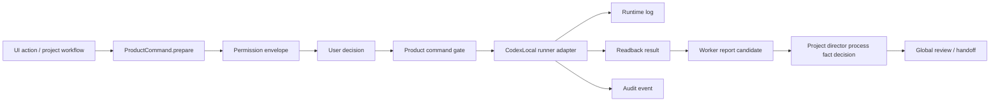

# Unified Product Command Routing Development Plan v1

日期：2026-06-09

状态：已按 PCR0-PCR10 收口，最终 checkpoint 结论为 `accepted_with_deferred_items`。本文用于把已有真实执行探针、安全边界、Level A 封堵和 UI 信息层级修补，收束成“工作台唯一真实执行产品链路”的开发计划。PCR10 已同步权威入口；后续新的真实执行仍必须另开任务包并重新授权。

## 1. 目标

本计划目标是完成统一 Product Command Routing，让工作台内所有真实执行只能经过同一条产品链路：

```text
prepare / preview
-> permission envelope
-> user decision
-> execute
-> runtime log
-> readback
-> worker report candidate
-> project director process fact decision
-> global review / handoff
```

完成后，用户在项目工作流里触发真实执行时，不再面对旧 workflow dispatch、旧 workflow machine、H5 preview、Phase B runner、MCP canvas runner、测试 probe 并存的混乱入口。旧入口可以保留为 legacy wrapper / developer-only / test-only，但不能绕过统一产品命令。

## 2. 已知事实

- H2 Phase B、H5-Level-B1、H5-Level-B2 已证明指定 `mario test` 范围内真实 `codex exec resume` 可受控执行，并产生 runtime log / audit / readback 证据。
- H3-B 已执行过一次真实 new-session fixture probe，但失败并完成分类；产品路径已补 `--skip-git-repo-check`，未二次授权重试。
- H4 Level A 已完成 readback / failure / timeout / duplicate guard 产品边界，不等于真实失败 / 超时 probe 完成。
- H5 checkpoint 已完成为 preview / readiness / permission envelope / B1-B2 probe / acceptance matrix 的产品边界收束。
- 修补计划 v2 已完成 Level A / D 收束：旧 Tauri / CLI / MCP canvas 普通入口已 guard，`Phase B` / `H3-B` runner 前已有统一 gate，UI 信息层级已初步收敛。
- 现在仍不能声明通用真实 send / resume 产品化完成，也不能声明所有真实执行入口已统一。

## 3. 未知和待主管决策

- 旧 `execute_workflow_node_dispatch` 是永久封存、保留 developer-only，还是迁移成统一 product command wrapper。
- 旧 `run_workflow_machine` 是永久封存、保留高级工作流机器，还是拆成 plan / preview / execute 多阶段 product command。
- CLI `__run_workflow_machine_real` 是否继续存在；如果存在，是否必须要求 danger flag、developer mode 和统一 product command id。
- 是否新增独立 sidecar `real-execution-product-commands.v1.json`，还是完全复用 `session-continuations.v1.json`、runtime log 和 audit refs。
- 真实执行 UI 是否在第一轮就开放“执行”按钮，还是先只接 preview / readiness / permission / blocked 状态。
- 是否在本计划内做 H3-B retry；建议否，retry 必须单独 Level B 任务包。

推荐主管决策：

- 不删除历史函数，先统一归口。
- 普通 UI 只接统一 product command。
- 旧入口继续 guard 或显式 legacy wrapper，不允许静默执行。
- 新增 product command read model；是否新增 sidecar 由 PCR0 冻结。
- Level B 真实 probe 放到最后，单独授权。

## 4. 非目标

本计划不做：

- 不接 Claude Code / OpenClaw / OpenCode / OpenCode-like 的真实执行。
- 不做 provider credential store，不做 model verification。
- 不开放自由聊天式任意 send / resume。
- 不允许前端拼命令或直接决定 runner 参数。
- 不读取 secret、token、`.env`、keychain、OAuth、provider credential、full transcript、rollout。
- 不把 transcript viewer 当作 execution readback。
- 不把 fake / no-op / unit test 当作真实执行。
- 不把普通浏览器 smoke 当作真实 Tauri 验收。

## 5. 当前入口矩阵

| 入口 | 当前事实 | 目标处理 |
| --- | --- | --- |
| `preview_h5_project_workflow_dispatch` | H5 preview，非真实执行 | 保留为 product command `prepare / preview` 来源之一 |
| `confirm_controlled_session_continuation` | 写 continuation confirmation | 纳入 product command `user decision` 链路 |
| `run_controlled_session_continuation_real_resume_phase_b` | 真实 resume runner 路径，已有 gate | 只能由统一 product command `execute` 调度 |
| H3-B new-session runner | 真实 new-session runner 路径，已有 gate | 只能由统一 product command `execute` 调度 |
| `execute_workflow_node_dispatch` | 旧 Tauri wrapper 已 blocked | 迁移为 legacy wrapper，不能自己调 runner |
| `run_workflow_machine` | 旧 Tauri wrapper 已 blocked | 拆为 plan / preview / execute 或 developer-only legacy wrapper |
| `read_workflow_node_dispatch_result` | 旧 readback wrapper 已 blocked | 不能冒充 H/H5 execution readback |
| `__run_workflow_machine_real` | CLI 已 blocked | developer-only 或永久封存；不得普通产品可达 |
| `canvas_start_run` / `canvas_tick_run` | MCP canvas command 已 blocked | 保持封存；如后续恢复必须接统一 product command |
| `mcp/codex_runner.rs` | 内部 runner 定义仍存在 | 后续入口矩阵必须纳入，不能普通 command 直达 |
| ignored real probes | 需 env / 显式授权 | 保持 test-only，不进入普通回归 |

## 6. 目标架构



架构约束：

- 前端只能调用 product command wrapper，不能直接调用 runner。
- 后端 product command 服务负责 request 构建、permission envelope、gate、runner 调度、runtime log、audit、readback。
- `CodexLocalRunner` 只负责 adapter 执行和 guard，不负责产品流程编排。
- `session_continuation_store` 继续保存 continuation / attempt / audit，但不应成为唯一入口分发器。
- runtime log 是运行事实，不是正式记忆。
- readback result 是执行读回，不是 transcript viewer。

## 7. 核心数据契约

推荐新增或收束以下契约。命名可在开发中调整，但语义必须稳定。

### 7.1 RealExecutionProductCommandRequest

必须包含：

- `product_command_id`
- `command_family`
- `operation_id`
- `project_id`
- `project_root`
- `workflow_id`
- `node_id`
- `work_item_id`
- `task_package_ref`
- `memory_packet_ref`
- `adapter_id`
- `session_mode`
- `target_session_id`
- `prompt_summary`
- `prompt_ref`
- `prompt_hash`
- `allowed_write_roots`
- `denied_paths`
- `readback_plan`
- `timeout_ms`
- `requested_by`
- `created_at`

### 7.2 RealExecutionProductCommandPreview

必须包含：

- `request`
- `permission_envelope`
- `readiness`
- `guard_preview`
- `diagnostics_summary`
- `duplicate_scope`
- `runtime_log_preview`
- `audit_preview`
- `readback_boundary`
- `warnings`
- `blocked_reasons`
- `prompt_sent=false`
- `real_codex_executed=false`
- `writes_codex_home=false`

### 7.3 RealExecutionProductCommandDecision

必须包含：

- `decision_id`
- `product_command_id`
- `decision`
- `confirmed_by`
- `confirmed_at`
- `store_revision`
- `risk_acknowledgement`
- `allowed_once`
- `reason`

确认规则：

- 高影响真实执行必须 `confirmed_by=user`。
- 项目主管确认不能替代用户确认。
- 用户拒绝必须写 audit / attempt，不调用 runner。

### 7.4 RealExecutionProductCommandAttempt

必须包含：

- `attempt_id`
- `product_command_id`
- `continuation_id`
- `adapter_id`
- `operation_id`
- `status`
- `started_at`
- `completed_at`
- `runner_call_allowed`
- `prompt_sent`
- `real_codex_executed`
- `writes_codex_home`
- `writes_project_files`
- `runtime_log_ref`
- `audit_refs`
- `readback_summary`
- `failure_reason`
- `warnings`

### 7.5 RealExecutionProductCommandStore

有两种实现路径：

- 路径 A：新增 `real-execution-product-commands.v1.json` sidecar，保存 command / preview snapshot / decision / attempt refs。
- 路径 B：不新增 sidecar，使用 `session-continuations.v1.json` + runtime log + audit refs，product command 只做派生读模型。

推荐路径 A，因为统一 product command 是产品层概念，不应完全塞进 session continuation；但 PCR0 必须先冻结是否新增 sidecar 和 revision 规则。

无论选择哪条路径，都禁止修改 `workflow-state.v0.json` 顶层结构，除非另开 migration 任务包。

## 8. 开发任务拆分

### PCR0：入口矩阵和主管决策冻结

类型：文档 / 只读复核。

目标：

- 冻结所有真实执行入口的处理方式。
- 决定是否新增 product command sidecar。
- 决定旧 CLI / Tauri / MCP / test probe 的目标状态。

产出：

- 任务包。
- 入口矩阵。
- sidecar 决策。
- 禁止冒领清单。

验收：

- 不改产品代码。
- 不执行真实 Codex。
- 不读写 `/Users/yoyi/.codex`。
- 复核线确认矩阵覆盖 Tauri / CLI / UI / MCP / tests / ignored probes。

### PCR1：后端契约和只读模型

类型：后端类型 / read model。

目标：

- 定义 product command 核心 Rust / TS 类型。
- 输出 WorkbenchSnapshot 中的 product command readiness / boundary summary。
- 不真实执行。

候选文件：

- `src-tauri/src/types.rs`
- `src-tauri/src/real_execution_command.rs`
- `src-tauri/src/lib.rs`
- `src/lib/types.ts`
- `src/lib/tauri.ts`

验收：

- `cargo test --lib real_execution_command`
- `cargo test --lib adapter_descriptor`
- `npm run typecheck`
- 不新增 runner 调用。

### PCR2：prepare / preview 服务

类型：后端应用服务。

目标：

- 把 `preview_h5_project_workflow_dispatch`、session continuation preview、diagnostics、duplicate guard、memory packet readiness 收束成统一 `prepare_product_command`。
- preview 永远不执行 Codex。

候选命令：

- `prepare_real_execution_product_command`
- `preview_real_execution_product_command`

必须验证：

- `prompt_sent=false`
- `real_codex_executed=false`
- `writes_codex_home=false`
- missing memory packet / stale memory / diagnostics degraded / duplicate active 均 blocked。

候选文件：

- `src-tauri/src/h5_project_dispatch_bridge.rs`
- `src-tauri/src/session_continuation_store.rs`
- `src-tauri/src/diagnostics_store.rs`
- `src-tauri/src/runtime_log_store.rs`
- `src-tauri/src/commands.rs`

### PCR3：decision / confirmation 服务

类型：后端写入。

目标：

- 将用户确认从散落 action 收束到统一 product command decision。
- 高影响真实执行必须用户确认。
- user rejected 写 attempt / audit，不调用 runner。

候选命令：

- `record_real_execution_product_command_decision`
- `confirm_real_execution_product_command`

验收：

- revision conflict 被拒绝。
- `confirmed_by != user` 的高影响真实执行被拒绝。
- rejected / request_changes 不调用 runner。
- audit refs 可追溯。

### PCR4：execute Phase A no-op / fake runner

类型：后端非真实执行。

目标：

- 统一 `execute` command 先接 fake / no-op runner。
- 验证 product command -> continuation -> runtime log -> readback -> audit 链路，不执行真实 Codex。

候选命令：

- `run_real_execution_product_command_phase_a`

验收：

- successful fake runner 写 product command attempt、continuation、runtime log、audit、readback refs。
- blocked cases 不调用 runner。
- readback unavailable / failed / timed_out `result_count=null`。

### PCR5：旧入口迁移 / 封存

类型：后端 wrapper / 前端 wrapper。

目标：

- `execute_workflow_node_dispatch`、`run_workflow_machine`、`read_workflow_node_dispatch_result`、`__run_workflow_machine_real`、`canvas_start_run`、`canvas_tick_run` 全部明确归口。
- App 不再用容易误读的 `executeWorkflowNodeDispatch` / `runWorkflowMachine` alias 作为普通 action 名。

处理策略：

- 普通 UI 只调用统一 product command。
- 旧 Tauri command 保持 blocked 或转为 legacy wrapper 调用统一服务。
- MCP canvas 真实 run 保持 sealed，除非单独任务包迁移到统一服务。
- CLI 若保留，必须 developer-only、danger flag、product command id、audit ref 缺一不可。

验收：

- 搜索普通前端代码不再直接调用旧 alias。
- 搜索 Tauri commands 中旧入口不能直达 runner。
- 搜索 `Command::new("codex")` 只保留在 runner adapter 内部。
- 复核线确认无普通入口绕过 product command。

### PCR6：UI 产品链路接入

类型：前端 UI。

目标：

- 项目页和智能体页显示统一真实执行链路，不再像内部状态堆叠。
- PermissionDialog 使用 product command permission envelope。
- 运行中工作流页显示 product command attempt / blocked / running / readback 状态。
- 管理入口显示 runtime log / audit / diagnostics ref，不铺 raw log。

候选文件：

- `src/App.tsx`
- `src/components/PermissionDialog.tsx`
- `src/views/ProjectsView.tsx`
- `src/views/AgentView.tsx`
- `src/views/RunningWorkflowsView.tsx`
- `src/components/RightDetailPanel.tsx`
- `src/lib/secretaryReadModel.ts`
- `tests/offline-permission-dialog.test.tsx`

UI 原则：

- 普通用户看到“准备执行 / 等待确认 / 运行中 / 已完成 / 已阻断 / 读回不可用”。
- 开发者看到 product command id、attempt id、runtime log ref、audit ref。
- 不显示完整 prompt、secret、full transcript、raw rollout。
- 秘书只解释影响面，不批准、不派发、不重试。

验收：

- `npm run typecheck`
- `npm run test:offline-interaction`
- `npm run build`
- 普通 UI 黑名单扫描：`H5 命令`、`允许一次`、`结果数：空`、`启动实验画布运行`、`已启动实验画布运行` 无命中。

### PCR7：failure / stop / retry 产品状态

类型：后端状态 + 前端显示。

目标：

- 建立失败、停止、重试的产品状态，但不默认自动重试。

必须覆盖：

- `user_rejected`
- `blocked_by_guard`
- `blocked_by_diagnostics`
- `duplicate_blocked`
- `blocked_stale_memory`
- `timed_out`
- `readback_unavailable`
- `readback_failed`
- `runner_failed`
- `manual_stop_requested`
- `retry_requires_new_user_confirmation`

约束：

- stop / retry 不得直接 kill 或重启真实进程，除非任务包明确授权。
- retry 必须生成新 product command decision 或明确复用允许一次的 decision。
- readback unavailable 不等于 0 条结果。

### PCR8：测试矩阵和安全扫描

类型：测试 / 复核。

Rust 必跑：

```text
cargo test --lib real_execution_command
cargo test --lib h5_project_dispatch_bridge
cargo test --lib session_continuation
cargo test --lib codex_local_runner
cargo test --lib runtime_log
cargo test --lib diagnostic
cargo test --lib workflow_authorization
cargo test --lib
cargo fmt -- --check
```

前端必跑：

```text
npm run typecheck
npm run test:offline-interaction
npm run build
```

扫描必须覆盖：

- 旧入口普通调用。
- 误导 UI 文案。
- `Command::new("codex")` 可达性。
- `.codex` 读写路径。
- secret / token / `.env` / full transcript / rollout。
- planned adapters 被误写成可用。

### PCR9：Level B 真实探针

类型：真实执行，单独授权。

前置：

- PCR0-PCR8 全部通过。
- PCR9A 统一 Product Command Phase B bridge 已通过主管复核；后续真实探针必须以 `run_real_execution_product_command_phase_b`、product command attempt、runtime / audit / readback refs 为完成证据。
- 用户明确授权测试项目和 `.codex` 读写范围。
- 复核线确认没有 P0/P1。

允许项目：

- `/Users/yoyi/Documents/mario test`
- 或主管线新建的隔离测试项目。

最小 probe：

- read-only resume probe。
- workspace-write resume probe。
- 如要 H3-B retry，必须单独写 new-session retry 任务包。

必须记录：

- target session / project root / command family / operation id。
- prompt summary / prompt ref / prompt hash。
- allowed write roots / denied paths。
- `.codex` access scope。
- runtime log ref。
- audit refs。
- readback result。
- file hash before / after。
- user decision。
- failure classification。

验收：

- 真实执行只能从统一 product command 触发。
- 所有结果可在 UI / runtime log / audit / readback 中对上。
- 失败也可接受，但必须分类，不得包装成成功。

### PCR10：最终复核和 checkpoint 收口

类型：只读复核 + 文档。

目标：

- 独立复核线确认无 P0/P1。
- 主管线汇总开发线、UI 线、真实探针线结果。
- 只在 checkpoint 同步权威入口。

产出：

- evidence。
- handoff。
- 当前计划收口记录。
- 如确实完成，再同步 `CURRENT.md`、`tasks/README.md`、`AUTHORITY.md`、`STAGE_PLAN.md`、`README.md`。

不能声明：

- planned adapters 已真实接入。
- provider credential / model verification 完成。
- 任意项目自由执行。
- 所有真实 runner 删除。
- 最终蓝图完成。

## 9. 分线职责

### 主管线

职责：

- 冻结 PCR0 决策。
- 派发开发线，不让多线同时改同一核心文件。
- 审核边界和任务包。
- 合并验证结果。
- 决定 checkpoint 文档同步。

禁止：

- 不抢开发线代码。
- 不在没有授权时执行真实 Codex。
- 不把 Level A 包装成 Level B。

### 后端线

职责：

- PCR1-PCR5 后端实现。
- product command service / store / wrapper / gate / tests。
- Rust focused tests 和全量 lib。

边界：

- 默认不改 UI 大布局。
- 不读写 `/Users/yoyi/.codex`。
- 不执行 ignored real probe。

### UI 线

职责：

- PCR6 UI 接入。
- PermissionDialog、Projects、Agent、Running、Right rail、secretary read model。
- 离线 UI 测试和文案黑名单。

边界：

- 不改 Rust runner。
- 不启动 Browser / Tauri，除非另有截图验收任务包。
- 不读取 `.codex` 插件。

### 复核线

职责：

- 只读查 P0/P1。
- 查普通入口是否可达 runner。
- 查 UI 是否冒领。
- 查 tests 是否覆盖 blocked / rejected / duplicate / readback unknown。

边界：

- 不改文件。
- 不跑真实 Codex。
- 不启动 Browser / Tauri。
- 默认不跑 npm / cargo，除非主管线要求。

### 真实探针线

职责：

- PCR9 Level B。
- 只在授权项目执行真实 Codex。
- 记录 evidence / handoff / hash / readback / audit。

边界：

- 不做架构开发。
- 不扩大授权项目。
- 不复用旧授权执行新 probe。

### 文档线

职责：

- checkpoint 收口时更新计划、evidence、handoff、权威入口。
- 不为每个小修同步全部入口。

## 10. 并行策略

可以并行：

- PCR0 只读入口矩阵和 UI 后续草图。
- PCR1 后端类型和 PCR6 UI 文案准备，但 UI 不接真实 invoke。
- PCR8 测试矩阵准备和复核线只读扫描。

不能并行：

- PCR2 / PCR3 / PCR4 同时大改 `session_continuation_store.rs`。
- 后端线和 UI 线同时修改 `App.tsx` action handler。
- 真实探针线在 PCR0-PCR8 未通过前执行 Level B。
- 文档线在代码未回收前同步权威入口。

推荐执行顺序：

1. PCR0。
2. PCR1 + 测试矩阵草案。
3. PCR2。
4. PCR3。
5. PCR4。
6. PCR5。
7. PCR6。
8. PCR7。
9. PCR8。
10. PCR9A。
11. PCR9。
12. PCR10。

## 11. 验收口径

PCR0-PCR8 完成后可以说：

- 统一 product command routing Level A 完成。
- 普通产品入口已归口。
- 真实 runner 只能通过统一 gate 或 test-only ignored probe 可达。
- UI 已展示统一执行链路。

PCR9 成功后才可以说：

- 指定测试项目上的统一 product command 真实执行探针通过。

仍不能说：

- 任意项目自由执行。
- planned adapters 真实执行。
- provider/model 验证完成。
- 自动重试/自动修复完成。
- 最终蓝图完成。

## 12. PCR10 收口记录

PCR10 已完成：`tasks/2026-06-09-unified-product-command-routing-pcr10-final-review-and-checkpoint-closure-v1.md`。

记录：

- `evidence/2026-06-09-unified-product-command-routing-pcr10-final-review-and-checkpoint-closure-v1.md`
- `handoffs/2026-06-09-unified-product-command-routing-pcr10-final-review-and-checkpoint-closure-v1-result.md`

最终结论：

```text
accepted_with_deferred_items
```

接受为：

- 普通旧入口已 guard / legacy 化。
- 真实执行归口统一 product command。
- PCR9 已在指定 `mario test` / 指定 `codex-local` session 上完成 B1/B2 真实 `resume` 探针。
- runtime log / audit / readback / product command attempt 可追溯。

不接受为：

- 任意项目自由执行。
- 通用自由 send / resume 控制台。
- planned adapters 真实接入。
- provider credential / model verification。
- 自动 retry / stop / restart。
- 真实 Tauri 全量验收。
- 最终蓝图完成。

保留 P2：

- read-only `allowed_write_roots` 口径需要说明不等于项目写授权。
- 底层 continuation warning 标签仍是命名债。

## 13. 风险和缓解

| 风险 | 缓解 |
| --- | --- |
| 旧入口保留导致误用 | 后端 guard + TS deprecated + UI 隐藏 / legacy 标签 + 复核线入口扫描 |
| product command store 和 continuation store 重叠 | PCR0 冻结 store 决策；明确 product command 是产品层，continuation 是会话层 |
| UI 过早显示执行按钮 | PCR6 先接 readiness / permission / blocked，execute 按钮等 PCR4/PCR8 通过 |
| Level B 探针扩大权限 | PCR9 单独授权，限制项目、session、write roots、`.codex` 范围 |
| readback unavailable 被误解为 0 | 统一 `result_count=null` 文案和测试 |
| transcript viewer 被当作 readback | 标题、字段、测试和文案隔离 |
| 多线程改同一文件冲突 | 主管线按 PCR 顺序派发，不让两线同时改同一核心文件 |

## 14. 开发前检查清单

开始 PCR1 之前必须确认：

- PCR0 任务包已写。
- 入口矩阵已冻结。
- sidecar 决策已冻结。
- 禁止真实执行边界已写入任务包。
- 后端线和 UI 线文件范围已分开。
- 复核线已准备只读检查标准。

开始 PCR9 之前必须确认：

- PCR0-PCR8 全部通过。
- PCR9A 已通过主管线和只读复核线复核，且没有未关闭 P0/P1。
- 用户明确授权真实执行。
- 明确测试项目、session、prompt summary、prompt hash、allowed write roots、`.codex` 范围。
- evidence / handoff 模板已准备。
- 失败也按失败验收，不包装成成功。
