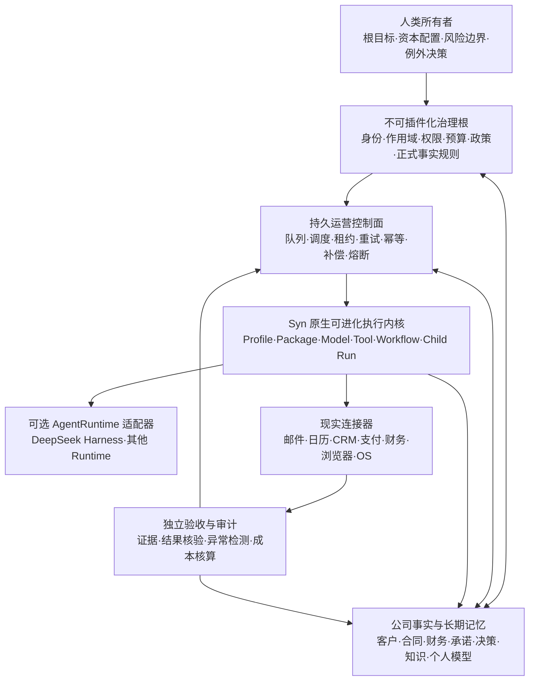

# DeepSeek Harness × AI OPC 研究参考报告 v1

日期：2026-08-16

状态：**当前研究参考 + Syn 原生核心与自升级方向的证据来源，不是实现授权。** 当前正式决定见 `decisions/2026-08-16-syn-native-governance-core-and-governed-self-upgrade-direction-v1.md`。

本文把 AI OPC 定义为：**AI 原生 One Person Company（一人公司）**。用户只保留最高层目标、资本配置、风险边界和例外决策，其余日常经营、组织、执行、检查、沉淀与改进尽量由 AI 完成。

“AI OPC”是本文根据用户目标做的产品与组织映射，不是 DeepSeek Harness 官方对自身的产品定位；官方当前只称其为 open-source agent harness。

本文补充而不替代：

- `docs/research/2026-08-14-deepseek-harness-reference-research-v1.md`
- `docs/research/2026-07-09-self-evolution-frontier-and-syn-design-v1.md`
- `docs/workbench-system-architecture-v1.md`
- `docs/current-state.md` 与当前 M1–M11 阶段计划

本文不把参考设计写成当前能力，不进入 backlog，不创建任务包，不授权接入 DeepSeek Harness、安装插件、调用真实 Provider、开启后台自治或修改产品代码。

---

## 0. 研究方法与证据边界

### 0.1 研究顺序

本轮先只使用 DeepSeek Harness 官方仓库、官方包文档与 Cordis 原始论文形成独立判断；独立结论冻结后，才读取仓库既有 DeepSeek Harness 报告并做对照，避免本地结论反向塑造外部研究。

### 0.2 证据分级

本文严格区分三类表达：

- **已实现事实**：官方仓库或包文档明确描述的当前机制。
- **架构推断**：从已实现机制映射到 AI OPC / Syn 的设计判断，不代表官方定位。
- **未知或待验证**：官方没有量化证据，或本轮没有做真实运行、源码安全审计和业务闭环验收的部分。

### 0.3 版本快照

本文绑定到 2026-08-16 只读复核到的官方 `master`：

- commit：`47f943859bef60e4160492346772ded9b24f765a`
- 根包版本：`0.1.0-rc.5`
- 官方状态：Developer Preview，明确提示仍会发生 breaking changes
- 固定快照：https://github.com/deepseek-ai/deepseek-harness/tree/47f943859bef60e4160492346772ded9b24f765a

后续若官方 `master`、稳定版本或核心合同变化，本文中的“当前能力”必须重新核对，不能当作永久事实。

### 0.4 本轮没有证明什么

- 没有在 Syn 中安装、集成或运行 DeepSeek Harness。
- 没有证明 DeepSeek Harness 能长期、无人值守地经营一家公司。
- 没有证明任何模型在真实业务里的成功率、成本、SLA、安全性或自主决策质量。
- 没有把插件存在、HTTP 成功、模型自报完成或 Session 可恢复等同于业务结果已完成。

---

## 1. 一句话结论

**用户与 DeepSeek Harness 真正接近的不是“想要一个更强的编码 Agent”，而是同一种权力结构：人定义最高层目标与边界，模型和工具成为可替换的执行劳动力，Harness 负责组合、运行、约束、记录和改进这支劳动力。**

但当前 DeepSeek Harness 更准确的定位是：

> **可插拔 Agent 微内核 / AI 劳动力运行时，而不是完整的 AI OPC 公司操作系统。**

因此，Syn 与 DeepSeek Harness 的合理关系不是二选一，也不是让 Harness 覆盖 Syn。当前更稳妥的选择是 Syn 自己掌握核心，同时保留接入 DSH 的能力：

- **Syn = 公司宪法、控制核心、正式事实、长期记忆与用户入口。**
- **Syn 原生 Agent Runtime = 默认 AI 劳动力执行层；DeepSeek Harness 可作为受治理的可选适配器或一致性样本。**
- **模型 = 可替换员工，不是系统最高权威。**
- **Plugin / Tool / Workflow = 岗位能力、部门能力与执行程序。**

最值得借的是“能力可组合、过程可重建、动作可拦截、运行时可演化”；最不能外包给插件系统的是身份、权限根、正式事实、预算上限、验收标准和最终责任。

---

## 2. DeepSeek Harness 的官方事实

### 2.1 “Everything is a Plugin”不是口号层模块化

官方架构明确把 Model Adapter、Tool Registry、Session Log、Agent Loop 本身都实现为 Cordis 插件。运行实例由 Profile、Bundle、Patch 叠加形成插件树，不存在必须修改的特权核心；能力通过 Service Definition、Provider、Consumer 三类 seam 进行替换。

这意味着：

- 换模型不必重写 Agent Loop。
- 换文件系统、进程或远程执行 Provider，可以整体迁移依赖这些能力的工具。
- 不同 Profile 可以形成不同工具、权限、提示词和运行模式组合。
- 新行为优先挂到事件或能力 seam，而不是持续侵入一份巨型核心。

“仓库中存在某个包”不证明某个部署已经启用它；实际运行能力必须以目标 Profile 的解析结果（例如 `dsh --profile ... --dump-config`）为准。

官方依据：

- https://github.com/deepseek-ai/deepseek-harness
- https://github.com/deepseek-ai/deepseek-harness/blob/master/docs/architecture.md

### 2.2 Session Event Log 是 Agent 上下文真源

DeepSeek Harness 使用 append-only `SessionEvent` log。Step、Turn、用户消息、模型消息、Tool Call 与 Tool Result 都形成持久事件；Fork、Resume、Transcript、Telemetry 和 Persistence 从这条流派生。

官方不变量是：**任何真正进入模型请求的内容，都必须可以从 Session Log 重建。**

这对 AI OPC 的价值是：执行过程不只剩最终自然语言总结，还可以回放“模型当时看见了什么、调用了什么、得到了什么”。

但边界必须保留：

- Session Log 是 Agent 执行轨迹，不自动是客户、合同、财务和经营承诺的正式账本。
- “日志里存在”不等于“内容已核真”。
- Compaction 产生的模型摘要仍可能遗漏、误解或继承旧错误。

官方依据：

- https://github.com/deepseek-ai/deepseek-harness/blob/master/docs/architecture.md
- https://github.com/deepseek-ai/deepseek-harness/blob/master/docs/subsystems/persistence.md

### 2.3 Step / Turn 与 Tool Pipeline 提供了可治理的执行切面

一个 Step 是一次模型请求及其工具调用；一个 Turn 可以由多个 Step 组成，直到没有后续工作。工具执行依次经过 pre-execute、execute、post-execute，并将最终结果写回事件流。

这给策略、审批、沙箱、遥测和结果规范化提供了明确切面，适合作为 Syn `Turn`、`ExecutionAttempt`、`WorkerHandoff`、Adapter Capability 与执行回执的参考。

官方依据：

- https://github.com/deepseek-ai/deepseek-harness/blob/master/docs/architecture.md
- https://github.com/deepseek-ai/deepseek-harness/blob/master/docs/tool-execution-pipeline.md

### 2.4 它已有安全积木，但不是公司级统一权限系统

当前官方机制包括：

- 失败封闭的一次性 Approval；无法取得批准时不静默放行。
- 文件系统 Sandbox Mode 与 Permission Preset。
- 外部副作用前的 Session Checkpoint。
- 崩溃后对不确定 Tool Call 标记 `TOOL_OUTCOME_UNKNOWN`，避免把未知冒充失败或成功。

同时，官方边界也很明确：

- Approval 主要是当前 Turn 内的一次性授权，不是持久组织政策、Grant Store、撤销系统或公司 IAM。
- Sandbox vocabulary 主要治理文件系统；网络、完整进程可见性和同 UID 凭据隔离不因此自动成立。
- Checkpoint 不是通用 exactly-once；现实副作用仍需要 Tool 以 `callId` 等键实现幂等。
- `danger-full-access` 之类模式不能进入 AI OPC 的默认执行路径。

官方依据：

- https://github.com/deepseek-ai/deepseek-harness/blob/master/docs/subsystems/approval.md
- https://github.com/deepseek-ai/deepseek-harness/blob/master/docs/subsystems/sandbox.md
- https://github.com/deepseek-ai/deepseek-harness/blob/master/packages/session/session-checkpoint-policy/README.md
- https://github.com/deepseek-ai/deepseek-harness/blob/master/packages/credentials/credentials-local/README.md

### 2.5 Goal、Schedule、Job、Workflow 已有原语，但还不是 24×7 公司运营层

DeepSeek Harness 已有目标续跑、定时调度、后台 Job、Subagent、Workflow 与 Ralph 循环等能力；它们证明运行时不是一次问答壳。

但当前限制包括：

- Goal 以当前 Session 的一个 durable objective 为中心；恢复后是否继续，需要显式 Resume。
- Schedule 属于 Session：原 Session 不活跃时不会形成独立常驻调度服务，冷 Session 恢复后才处理 overdue。
- Local Job 是进程内状态，进程退出后不构成持久队列。
- Workflow / Ralph 缺少完整的进程级 Journal、Resume、Token/Price/Time Budget 和独立 Verifier。
- Worker 自报 complete / blocked 不等于业务验收成立。

官方依据：

- https://github.com/deepseek-ai/deepseek-harness/blob/master/packages/goal/goal/README.md
- https://github.com/deepseek-ai/deepseek-harness/blob/master/packages/goal/goal-round-driver/README.md
- https://github.com/deepseek-ai/deepseek-harness/blob/master/packages/schedule/schedule/README.md
- https://github.com/deepseek-ai/deepseek-harness/blob/master/packages/jobs/jobs-local/README.md
- https://github.com/deepseek-ai/deepseek-harness/blob/master/packages/workflow/workflow/README.md
- https://github.com/deepseek-ai/deepseek-harness/blob/master/packages/workflow/tool-ralph/README.md

### 2.6 动态 Cordis Tool 展示了“运行时自我改造”的方向

官方提供了主动 opt-in 的 Dynamic Cordis Tool Package，允许模型检查运行时并定义、运行、停止动态 Cordis Package。它不在任何默认 shipped tree 中；只有部署者显式挂载后才存在。它体现的不是简单换 Prompt，而是让模型生成新的工具、服务和运行组合候选。

当前官方边界是：

- 动态 Package 只存在于进程内存。
- 停止或重启后消失。
- 不会自动安装、写配置或晋升为持久插件。
- 默认组合不挂载，不能把仓库中存在该包写成产品默认开启自我进化。
- 可能影响同一进程中的其他 Session。
- Worker + `node:vm` 不是恶意代码安全沙箱，应按 Bash 等高危执行能力治理。

所以它适合做“候选生成实验室”，不能直接作为“AI 自己修改公司并自动上线”的生产通道。

官方依据：

- https://github.com/deepseek-ai/deepseek-harness/blob/master/packages/extensions/tool-cordis/README.md
- https://github.com/deepseek-ai/deepseek-harness/blob/master/packages/workflow/workflow-worker-thread/README.md

### 2.7 必须区分内置能力、扩展接口与未来可能性

| 层级 | 当前可以确认的范围 | 不能据此声称 |
|---|---|---|
| 官方内置能力 | 文件、Shell/Terminal、Web Search/Fetch、LSP、Session、Goal、Subagent、Workflow、Ralph、Approval、Sandbox 等编码/工作区 Agent 原语 | 已覆盖公司经营所需的全部业务软件 |
| 官方扩展接口 | Profile、Plugin、Provider Seam、MCP Tool Bridge、自定义 Tool 与动态 Cordis Package | 接口存在就代表插件已存在、可信、可维护或达到生产质量 |
| 未来可扩展方向 | 邮件、日历、CRM、支付、财务、客服、营销、GUI/Computer Use 等可通过连接器或插件接入 | DeepSeek Harness 今天已经安全接管这些应用 |

官方 MCP Client 当前确认的是把外部 MCP **Tools** 注册进 `ctx.tools`；这证明扩展入口存在，不等于 Resources、Prompts、通用 GUI 控制或完整业务连接器套件已经交付。

官方依据：

- https://github.com/deepseek-ai/deepseek-harness/blob/master/packages/mcp/mcp-client/README.md

---

## 3. Cordis 理念与它的真实边界

Cordis 论文当前是 active-revision preprint，讨论的是动态组件的时空可组合性：

- **时间可组合性**：组件被卸载后，撤销它在运行时注册的 effect。
- **空间可组合性**：组件声明依赖，并随依赖可用性进行响应式激活与停用。

论文进一步把“自我进化 Agent Harness”列为未来方向：Harness 可以持续生成和部署自身组件变化，动态可组合性将成为重要基础。

这与 AI OPC 的长期形态高度一致，但必须同时保留论文自己的限制：

- 运行时接受组件作者提供的 inverse，不验证它是否真的恢复原状态。
- 文件写入、网络发送、付款、合同和现实承诺等外部副作用，不属于自动可逆边界。
- 不可信插件仍需外部 Sandbox；依赖声明不能替代恶意代码隔离。
- 当前经验材料主要来自 Koishi 生态，不是 AI OPC 的对照实验。
- 论文没有给出自进化 Harness 的生产成功率、经济性或安全性证明。

因此：

> **Cordis 可以帮助执行系统持续改变组成，但不能证明一个公司能够安全地撤销现实、自动验证自身改进，或让治理根也成为普通插件。**

官方依据：

- https://github.com/cordiverse/paper
- https://github.com/cordiverse/paper/blob/main/paper.pdf

---

## 4. AI OPC 的核心不是“全自动”，而是“决策分层”

用户“只做最高层决策”不等于关闭 Approval。真正目标是把用户反复做出的判断编译成稳定政策，使 AI 在政策内自行决策，只把根目标冲突、不可逆影响和高风险例外上浮。

### 4.1 五级决策权

| 级别 | 典型动作 | 默认处理 | 用户是否介入 |
|---|---|---|---|
| L0 观察 | 读取、搜索、分析、模拟、生成草案 | 自动执行并留来源 | 否 |
| L1 低风险经营 | 小额、可逆、预算内、成熟 SOP 内动作 | 自动执行 + 记录 | 通常否 |
| L2 对外可补偿 | 发普通通知、有限发布、可撤销业务动作 | 政策判定 + 独立验收 + 补偿方案 | 异常时 |
| L3 高影响决策 | 大额资金、法律、声誉、不可逆承诺、目标冲突 | 必须上浮 | 是 |
| L4 治理根 | 改公司目标、权限根、预算上限、审计规则、插件信任链 | 只能由用户签署 | 始终 |

### 4.2 用户应长期保留的最高层决策

- 公司存在的目的与阶段目标。
- 资本如何配置、最大可承受损失与现金安全线。
- 哪些法律、伦理、隐私和声誉边界不可突破。
- 何时进入、退出或改变业务方向。
- 哪些现实承诺必须由本人作出。
- 谁或什么系统可以取得新的能力、凭据和权限。
- 什么才算最终成功，哪些失败可以接受。

其余决策应尽量通过 Policy、Budget、SOP、Verifier 与 Escalation Rule 下沉，而不是靠用户逐次批准每个 Tool Call。

---

## 5. 推荐形态：不可插件化治理根 + Syn 原生可进化执行内核



### 5.1 为什么必须双核

- 如果治理根也可被 Agent 动态卸载，权限和验收标准可以被执行者重写。
- 如果执行内核完全不可组合，系统又会被一个模型、一套工具和一条工作流锁死。
- 所以稳定的应是权力、事实和责任；可变化的应是模型、岗位、工具、流程和实现。

### 5.2 DeepSeek Harness 概念与 AI OPC 的映射

| DeepSeek Harness 概念 | AI OPC 中的角色 | 必须补上的边界 |
|---|---|---|
| Cordis Context | AI 劳动力运行环境 | 不能成为公司正式事实根 |
| Profile / Preset | 岗位与部门运行配置 | 由治理核心批准能力集合 |
| Plugin / Tool | 专业能力与行动器官 | 权限、供应链、版本和责任归属 |
| Agent Loop | 员工执行节奏 | 外部预算、超时、暂停与接管 |
| Session Event Log | 工作轨迹与上下文证据 | 不等于客户/合同/财务账本 |
| Goal | 单次经营目标 | 外部 Portfolio、优先级和依赖治理 |
| Subagent / Workflow | 临时项目团队与 SOP | 持久队列、验收、重试、责任链 |
| Approval / Sandbox | 委托权限的基础积木 | 公司级 IAM、长期 Policy 和凭据代理 |
| Opt-in Dynamic Package | 流程和能力改进实验室 | 默认关闭、独立评估、签名晋升、回滚和禁止自批 |

---

## 6. DeepSeek Harness 距离 AI OPC 还缺的上层系统

| 缺口 | 当前官方证据能证明什么 | AI OPC 仍需什么 |
|---|---|---|
| 公司治理 | 有 Tool Approval、Sandbox、事件切面 | 统一身份、作用域、持久授权、撤销、职责分离、权限变更账本 |
| 公司事实 | 有可回放 Session Log | 客户、合同、财务、承诺和决策的权威状态、版本与来源治理 |
| 长期记忆 | 有 Session 持久化、引用和 Compaction | 可纠错、可遗忘、可冲突消解、按 Scope 和敏感性治理的个人/公司记忆 |
| 24×7 运营 | 有 Goal、Schedule、Job、Workflow 原语 | 独立 Daemon、持久队列、Lease、Retry、Dead Letter、Exactly-once 近似语义 |
| 现实副作用 | 有 Checkpoint 与未知结果封口 | Prepare/Commit、幂等键、补偿 Saga、回读核验和人工接管 |
| 独立验收 | 有轨迹、Tool Result、Worker Report | 与执行者分离的确定性 Oracle、Reviewer、业务验收和 False-green 防线 |
| 成本治理 | 有上下文 Token 估算 | 按目标/项目/Agent 的钱、Token、时间、算力预算与异常消费熔断 |
| 业务覆盖 | 有文件、Shell、Web、LSP、MCP Tool Bridge 等 | 邮件、日历、CRM、支付、财务、客服、营销和 GUI/OS 的受治理连接器 |
| 多 Agent 责任链 | 有 Child Session 与报告原语 | 持久 Mailbox、Delivery Receipt、Retry、责任归属、跨进程恢复 |
| 远程控制面 | 有 Web / Headless 组合 | 认证、TLS、设备配对、Origin Policy、E2E、暴露诊断和多用户隔离 |

这不是说 DeepSeek Harness “不够好”，而是说明 Agent Runtime 与 Company Operating System 是不同层级的问题。

### 6.1 AI OPC 部署不能忽略的威胁模型

- **同 UID Agent**：本地凭据文件的 `0600/0700` 保护其他 OS 用户，不保护以同一用户运行的 Bash 或文件工具；官方称其为 discretion，而非 security boundary。
- **恶意或被注入的插件代码**：文件系统 Sandbox 和 `node:vm` 都不能独自构成对恶意代码的完整隔离边界。
- **远程暴露**：当前 Webserver v1 没有内建 TLS、认证和 Origin Policy；默认 loopback 开发体验不能直接升级成远程公司控制面。
- **内网访问**：官方本地 Web Fetch Backend 不阻断私网目标；在可达敏感内网的部署中存在 SSRF 类风险。
- **遥测与隐私**：Telemetry 是 best-effort handoff，不保证送达；默认没有内建 Redaction Rule，完整事件数据可能包含文件内容、命令输出或其中的凭据。
- **供应链**：Plugin seam 越开放，越需要来源固定、版本 Pin、能力清单、安装脚本检查、签名晋升和撤销能力。

这意味着 AI OPC 至少要分别建模：可信单机操作者、同 UID Agent、恶意插件、Prompt Injection、外部连接器、远程控制面与共享遥测；不能用一个“有 Sandbox”标签覆盖全部威胁。

官方依据：

- https://github.com/deepseek-ai/deepseek-harness/blob/master/packages/credentials/credentials-local/README.md
- https://github.com/deepseek-ai/deepseek-harness/blob/master/packages/workflow/workflow-worker-thread/README.md
- https://github.com/deepseek-ai/deepseek-harness/blob/master/packages/host/webserver/README.md
- https://github.com/deepseek-ai/deepseek-harness/blob/master/docs/subsystems/web.md
- https://github.com/deepseek-ai/deepseek-harness/blob/master/packages/session/session-telemetry/README.md

---

## 7. 自我进化必须是“候选晋升”，不能是“自己改、自己批、自己上线”

推荐的闭环：

```text
真实反馈 / 失败 / 成本异常
  -> 生成 Skill / Profile / Plugin / Policy 候选
  -> 静态能力与权限差异分析
  -> 隔离环境回放与确定性测试
  -> 独立 Reviewer / Verifier 对照旧版本
  -> 小流量 Canary
  -> 用户或受托治理核心签名晋升
  -> 可观测运行
  -> 失败时回滚或停用
```

硬约束：

- 候选生成者不能同时是最终验收者。
- 执行 Agent 不能改写或读取隐藏的核心 Oracle。
- 修改权限根、Sandbox、Approval、审计、预算或 Verifier 本身，始终属于 L4。
- 现实副作用没有可靠补偿时，不允许用“插件可卸载”声称可回滚。
- 没有便宜、精确、难以被钻空子的外部验证器时，自我进化只能停在建议或草案。

这与 `docs/research/2026-07-09-self-evolution-frontier-and-syn-design-v1.md` 的结论一致：安全自动化的分界线不是模型是否聪明，而是是否存在独立、可信、可执行的验证器。

---

## 8. 与 Syn 当前架构的关系

### 8.1 Syn 已经拥有 DeepSeek Harness 不负责解决的部分

Syn 当前目标架构已经明确：

- 控制核心掌握身份、作用域、权限、状态机、政策、审计和完成判定。
- 项目是复杂结构化工作的最高业务对象，个人范围与之并存。
- 项目黑板承接多 Agent 中间态；只有控制核心能把候选升级为正式事实。
- 事件账本、当前快照与 Outbox 分工，不做全量 Event Sourcing。
- 记忆必须经过来源、Scope、敏感性、冲突、时效和政策治理。
- 秘书、全局主管、项目主管承担不同决策层级和作用域。

这些不是 DeepSeek Harness 的替代功能，而是它若进入 Syn 必须服从的上层合同。

### 8.2 Syn 应原生吸收、而不是绑死在 DeepSeek Harness 上的部分

- Service / Provider / Consumer 式能力 seam，以及 Model / Tool / Loop / Storage / Interface 的可替换边界。
- Step / Turn、Tool Pipeline 与执行事件的清晰边界。
- Session Context 的可重建与运行轨迹查看。
- Profile / Preset 驱动的岗位能力组合。
- Subagent、Workflow、Goal 与运行时扩展原语。
- Opt-in Dynamic Cordis Tool 这类“生成候选能力”的实验机制；候选产生与正式晋升必须分开。

这些是实现方法，不是必须依赖某个 npm 包的理由。Syn 可以在自己的 Rust 控制核心和运行工作单元中实现同等合同；只有当 DSH 适配能在隔离对照中证明降低成本、且不侵入治理根时，才把它作为一个可替换 runtime 接入。

### 8.3 推荐的从属关系

```text
Syn 控制核心
  -> 校验项目、身份、作用域、预算、方案和动作风险
  -> 生成有界 Execution Contract
  -> AgentRuntimeGateway 选择受批准的原生或外部 Runtime Profile / Provider / Tool Set
  -> 可销毁 Runtime Workcell 执行并返回轨迹、结果和错误
  -> 独立 Verifier / 项目主管回收
  -> 控制核心决定是否升级为正式事实、状态或记忆候选
```

任何 Runtime Session、Harness Session、Tool Result、Worker Report 或模型总结，都不能绕过这条链直接修改 Syn 正式状态。DSH 若接入，只实现 `AgentRuntimeAdapter`；它不拥有 `RoleSession`、`ExecutionGrant`、公司事实、长期记忆、ConnectorGateway 或最终验收。

### 8.4 后续可研究的最小边界合同

下列只是字段级研究建议，不代表 Syn 已存在这些类型：

```text
ExecutionLease
- role / scope / objective_ref
- allowed_capabilities / explicit_denials
- budget / deadline / stop_conditions
- connector_grants / credential_refs
- evidence_contract / idempotency_key
- policy_version / runtime_profile_digest

ExecutionReceipt
- trace_ref / action_refs / external_effect_refs
- evidence_refs / cost / failures / unresolved
- CandidateFact / MemoryCandidate / SkillCandidate
- DecisionRequest / verifier_status
```

对外写动作还需要独立于 Harness Session 的持久链：

```text
ActionIntent
  -> policy check
  -> durable outbox
  -> execute
  -> source read-back
  -> reconcile or compensate
  -> audit receipt
```

检验这份边界是否成立，可以问三个问题：

1. 杀掉并重建 Harness 工作单元后，公司事实、任务进度和未完成外部动作能否恢复？
2. 外部动作中途崩溃后，能否避免或识别重复扣款、重复发送和重复写入？
3. 执行 Agent 声称完成时，能否由不依赖其自述的验证者拒绝晋级？

---

## 9. 对 2026-08-14 既有报告的补充与校准

既有 `2026-08-14-deepseek-harness-reference-research-v1.md` 适合作为“当前是否接入、哪些工程机制值得参考”的阶段性决策材料。它正确强调：

- Harness 不应替代 Syn 控制核心。
- Session Log 不等于 Syn 正式事件账本。
- Provider 技术支持不等于已获业务授权。
- Git-hosted Plugin 与沙箱外安装脚本需要单独供应链治理。

本报告补充三个长期层面：

1. **组织意义**：模型是可替换劳动力，Harness 是岗位与能力运行时，不只是 M5/M8 技术组件。
2. **自我进化意义**：Opt-in Dynamic Cordis Tool 展示了运行时产生新能力候选的方向，但它不是默认能力，晋升权也必须在 Syn 治理根之外独立把关。
3. **AI OPC 决策结构**：用户减少的应是日常决策次数，不是放弃根目标、资本、权限和不可逆风险的最终权力。

两处措辞需要按官方事实收紧：

- “没有用户批准链”不宜写成绝对事实。DeepSeek Harness 已有一次性、失败封闭的 Approval seam；准确表述应是“没有 Syn 所需的持久公司级身份、作用域和授权治理”。
- “Cordis 可逆卸载”只应指受管理的运行时注册和声明 effect，不应外推为文件、网络、付款或现实承诺自动可逆。

阶段判断：M1–M4 已完成的具名范围不因本报告重开，本报告也不自动激活 M5 / M8 或 Harness 集成；但长期蓝图不应只把 DSH 缩成 Tool Registry 或 Provider Adapter 的局部参考。

---

## 10. 分阶段研究与吸收路线

以下是研究路线，不是当前任务：

### A. 治理合同先行（M5 设计输入）

产物：

- AI OPC Constitution：L0–L4 决策权和不可委托清单。
- Execution Contract：目标、Scope、预算、工具、凭据、时限、验收和补偿。
- Plugin Trust Contract：来源、版本、能力清单、签名、升级和撤销。

进入条件：M1 控制核心合同明确。

### B. 隔离 Runtime 对比实验（M5 / M8 可选对照）

产物：

- Session Event 与 Syn `WorkbenchEventEnvelope` 映射。
- Step / Turn / ExecutionAttempt / Handoff 状态映射。
- Approval、Sandbox、Checkpoint 与 Syn Policy 的差异矩阵。
- 单一合成项目、零真实外部副作用的运行证据。

进入条件：有独立实验目录、固定版本和确定性验收。

### C. 单连接器经营闭环

选择一个低风险、可回读、可补偿的连接器，验证：

- 计划 -> 授权 -> 执行 -> 回读 -> 验收 -> 记账 -> 异常补偿。
- 成本预算、幂等、超时和人工接管。
- Session 轨迹与公司事实账本分离。

进入条件：M5/M8 合同与 ConnectorGrant / CredentialRef 成熟。

### D. 受治理自我进化（M11）

只允许在有外部 Verifier 的窄域中自动生成候选，例如：

- Prompt / Skill / SOP 的增量优化。
- Provider 版本适配。
- 有失败复现的 Bug 修复。
- 可量化的性能与成本优化。

所有候选停在独立分支、Worktree 或隔离 Package；改变业务目标、用户体验取舍、安全闸和治理根仍需用户批准。

---

## 11. 成功标准

AI OPC 不是看“能不能连续调用很多工具”，而是看：

- 用户是否只处理真正高层、异常和不可委托决策。
- 日常经营是否能在明确政策与预算内持续闭环。
- 每个现实动作是否有权威状态、幂等语义和可核结果。
- 执行者是否无法自行降低验收标准或扩大权限。
- 失败是否会封闭、上浮、补偿和留下可追溯证据。
- 长期记忆是否可纠错、可回源、可按 Scope 使用。
- 模型、Provider、Tool 与 Workflow 是否可以替换而不改变公司治理。
- 自我改进是否带来可测净收益，而不是只增加复杂度和调用成本。

如果这些条件没有同时成立，“无人值守”只是在放大未知副作用，不是 AI OPC 成熟。

---

## 12. 当前未知与复核触发条件

### 当前未知

- DeepSeek Harness 没有官方公布的完整 Benchmark 分数、对照组、安全评测、成本曲线或 SLA。
- Developer Preview 仍明确允许 breaking changes，包边界和能力可能快速变化。
- 本轮没有验证其在 Syn、macOS 当前环境和真实业务连接器中的运行表现。
- 没有证据证明 Session-level 自治可以自然扩展为公司级长期自治。
- AI OPC 首个真实经营闭环选择哪一类业务，仍需由用户的现实优先级决定。

### 必须重新研究的触发条件

- DeepSeek Harness 发布稳定版或重构核心事件、权限、持久化与 Profile 合同。
- 官方提供 Durable Job/Scheduler、长期 Goal Resume、独立 Verifier 或成本预算能力。
- Syn 准备激活 M5 / M8 的具体 AgentRuntimeAdapter / Connector 任务。
- 准备引入 Dynamic Cordis Tool、动态 Plugin 或任何自我改造能力。
- 准备让 AI 代表用户进行支付、发布、合同、客户承诺或其他高影响现实动作。

---

## 13. 官方一手资料索引

- DeepSeek Harness 官方仓库：https://github.com/deepseek-ai/deepseek-harness
- 架构：https://github.com/deepseek-ai/deepseek-harness/blob/master/docs/architecture.md
- Tool Pipeline：https://github.com/deepseek-ai/deepseek-harness/blob/master/docs/tool-execution-pipeline.md
- Persistence：https://github.com/deepseek-ai/deepseek-harness/blob/master/docs/subsystems/persistence.md
- Approval：https://github.com/deepseek-ai/deepseek-harness/blob/master/docs/subsystems/approval.md
- Sandbox：https://github.com/deepseek-ai/deepseek-harness/blob/master/docs/subsystems/sandbox.md
- Session Checkpoint：https://github.com/deepseek-ai/deepseek-harness/blob/master/packages/session/session-checkpoint-policy/README.md
- Goal：https://github.com/deepseek-ai/deepseek-harness/blob/master/packages/goal/goal/README.md
- Goal Round Driver：https://github.com/deepseek-ai/deepseek-harness/blob/master/packages/goal/goal-round-driver/README.md
- Schedule：https://github.com/deepseek-ai/deepseek-harness/blob/master/packages/schedule/schedule/README.md
- Local Jobs：https://github.com/deepseek-ai/deepseek-harness/blob/master/packages/jobs/jobs-local/README.md
- Workflow：https://github.com/deepseek-ai/deepseek-harness/blob/master/packages/workflow/workflow/README.md
- Ralph：https://github.com/deepseek-ai/deepseek-harness/blob/master/packages/workflow/tool-ralph/README.md
- Dynamic Cordis Tool：https://github.com/deepseek-ai/deepseek-harness/blob/master/packages/extensions/tool-cordis/README.md
- Workflow Worker Thread：https://github.com/deepseek-ai/deepseek-harness/blob/master/packages/workflow/workflow-worker-thread/README.md
- Local Credentials：https://github.com/deepseek-ai/deepseek-harness/blob/master/packages/credentials/credentials-local/README.md
- MCP Client：https://github.com/deepseek-ai/deepseek-harness/blob/master/packages/mcp/mcp-client/README.md
- Webserver：https://github.com/deepseek-ai/deepseek-harness/blob/master/packages/host/webserver/README.md
- Web Subsystem：https://github.com/deepseek-ai/deepseek-harness/blob/master/docs/subsystems/web.md
- Session Telemetry：https://github.com/deepseek-ai/deepseek-harness/blob/master/packages/session/session-telemetry/README.md
- Benchmark 说明：https://github.com/deepseek-ai/deepseek-harness/blob/master/BENCHMARK.md
- Cordis 论文仓库：https://github.com/cordiverse/paper
- Cordis 原始论文：https://github.com/cordiverse/paper/blob/main/paper.pdf

---

## 14. 最终判断

**DeepSeek Harness 不是现成的 AI OPC，但它非常接近 AI OPC 执行内核应有的方向。**

它最重要的启发不是“多装几个 Agent”，而是：

- 公司能力不应绑死在单一模型上。
- 角色、工具、流程和界面应当可组合、可替换、可观察。
- 模型看见的上下文和发生过的动作必须能够重建。
- 自我进化应发生在受治理的候选层，而不是治理根。
- 用户应从日常操作员升级为所有者和最高决策者，但不能放弃不可委托的最终责任。

对 Syn 最合适的吸收方式是：**自己实现控制核心、事实层、持久运营、记忆治理、角色体系和默认执行内核；吸收 DSH 的插件 seam、事件轨迹、工具管线、失败语义和动态候选方法，并把 DSH 本身降为可选、可替换、可卸载的 `AgentRuntime` 适配对象。**
